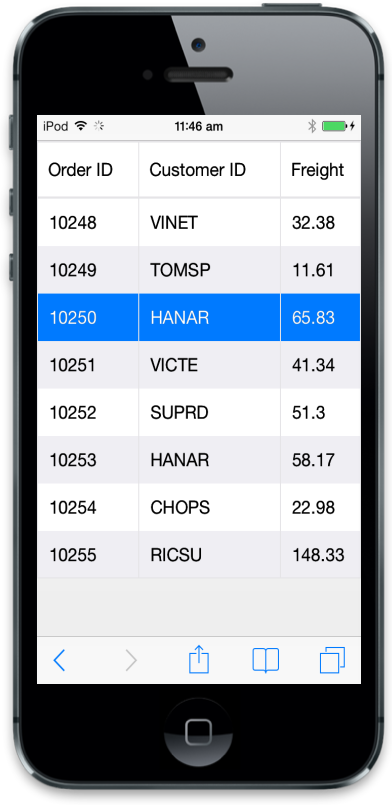
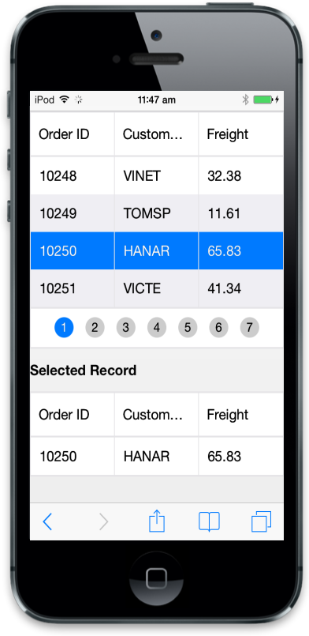

# Selection

The Selection Property is used to highlight a row that you select. By default, the Mobile Grid allows row selection. Refer the following code example.



@(Html.EJMobile().Grid<object>("MobileGrid")

.Datasource(d => d.URL("http://mvc.syncfusion.com/Services/Northwnd.svc/Orders/").Offline(true))

.Columns(col =>

{

col.Field("OrderID").HeaderText("Order ID").Add();

col.Field("CustomerID").HeaderText("Customer ID").Add();

col.Field("Freight").HeaderText("Freight").Add();

})

.AllowPaging(true)

.AllowSelection(true))



Execute the above code to render the following output.

## Get selected record data

In this section, you can learn how to get selected records from one Grid and also how those records are used to update datasource of another Grid. Refer the following code example.




@(Html.EJMobile().Grid<object>("MobileGrid")

.Datasource((IEnumerable<object>)ViewBag.datasource)

.Columns(col =>

{

col.Field("FirstName").HeaderText("First Name").Add();

col.Field("LastName").HeaderText("Last Name").Add();

col.Field("Email").HeaderText("Email").Add();

})

.ClientSideEvents(e => e.RowSelected("onRowSelect")))

<h2>Selected Record</h2>

@(Html.EJMobile().Grid<object>("NewGrid")

.Datasource((IEnumerable<object>)ViewBag.datasource)

.Columns(col =>

{

col.Field("FirstName").HeaderText("First Name").Add();

col.Field("LastName").HeaderText("Last Name").Add();

col.Field("Email").HeaderText("Email").Add();

}))









namespace MVCSampleBrowser.Controllers.Grid

{

public class GridController : Controller

{

public class Person

{

public string FirstName { get; set; }

public string LastName { get; set; }

public string Email { get; set; }

}

public ActionResult GridView()

{

List<Person> Persons = new List<Person>();

Persons.Add(new Person() { FirstName = "John", LastName = "Beckett", Email = "john@syncfusion.com" });

Persons.Add(new Person() { FirstName = "Ben", LastName = "Beckett", Email = "ben@syncfusion.com" });

Persons.Add(new Person() { FirstName = "Andrew", LastName = "Beckett", Email = "andrew@syncfusion.com" });

ViewBag.datasource = Persons;

return View();

}

}

}




