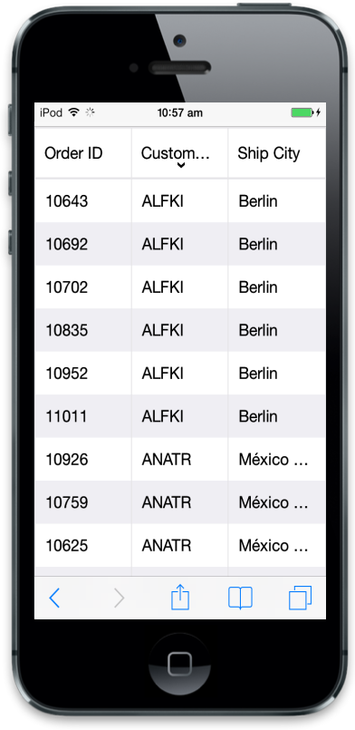
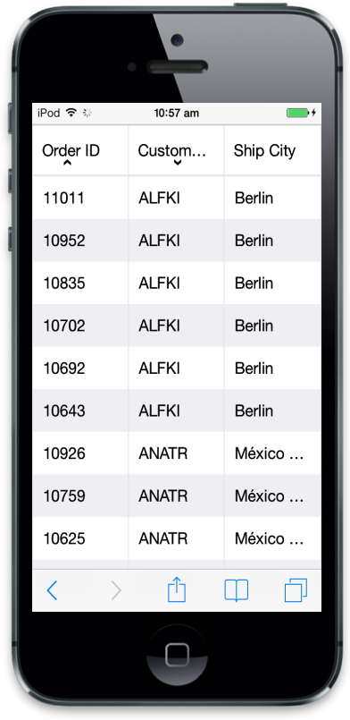

# Sorting

## Default 

Sorting is a basic technique in ejmGrid. It helps you in viewing grid records through ascending or descending based on particular column. If you want to enable sorting in Grid, use AllowSorting property at Grid initialize. By default, sorting operation can perform through user interaction (UI) on Grid header.



@(Html.EJMobile().Grid<object>("MobileGrid")

.Datasource("http://mvc.syncfusion.com/Services/Northwnd.svc/Orders/")

.Columns(col =>

{

col.Field("OrderID").HeaderText("Order ID").Add();

col.Field("CustomerID").HeaderText("Customer ID").Add();

col.Field("ShipCity").HeaderText("Ship City").Add();

})

.AllowSorting(true))



Result of the above code snippet:

## Multi sorting 

ejmGrid also has support to sort more than one column known as Multisorting. To enable this behavior in Grid you can use AllowMultiSorting in Mobile Grid. 



@(Html.EJMobile().Grid<object>("MobileGrid")

.Datasource("http://mvc.syncfusion.com/Services/Northwnd.svc/Orders/")

.Columns(col =>

{

col.Field("OrderID").HeaderText("Order ID").Add();

col.Field("CustomerID").HeaderText("Customer ID").Add();

col.Field("ShipCity").HeaderText("Ship City").Add();

})

.AllowSorting(true)
.SortOption(s=>s.AllowMultiSorting (true)))



Execute the above code to render the following output.

_Multi sorting_

