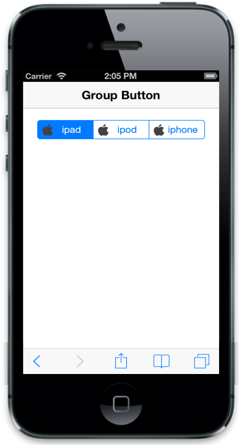

# Customize Image

## ImageClass

By using this property, you can add specific style to each Group Button item. When a string value is given to ‘ImageClass’ attribute, it adds as a class in the particular item. You can add an image or style by using that class. To achieve this, you can add ‘ImageClass’ attribute to every item.



@Html.EJMobile().GroupButton("groupbutton_sample").GroupButtonType(GroupButtonType.radio).

Name("options").Buttons(button =>

{

button.Add().Text("ipad").ImageClass("apple");

button.Add().Text("ipod").ImageClass("apple");

button.Add().Text("iphone").ImageClass("apple");

})



The following screenshot displays the Image Class:

## ImageUrl

ImageUrl property takes the image given in ‘Imageurl’ attribute and displays the image before the text in Group Button item.



@Html.EJMobile().GroupButton("groupbutton_sample").GroupButtonType(GroupButtonType.radio).

Name("options").Buttons(button =>

{

button.Add().Text("ipad").ImageUrl("ipad.png");

button.Add().Text("ipod").ImageUrl("ipod.png");

button.Add().Text("iphone").ImageUrl("iphone.png");

})



The following screenshot displays the Image URL:

