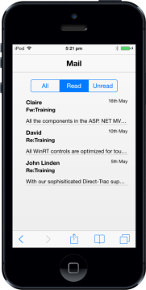

# Getting Started

This section briefly describes how to create a Group Button and use it in your application. 

## Create your first Group Button in MVC

The ASP.NET MVC Mobile Group Button allows you to display multiple buttons that is stacked together in a single line and appears like a navigation component. The following section explains you to create Group Button widgetusing a Mail App.

{  | markdownify }
{:.image }

Create the required Layout

The ASP.NET MVC Mobile Group Button widget is created with Radiobutton or Checkbox using the “GroupButtonType” property. In the Mail App, you can use the Radiobutton as input element to view the Mail content with three options “All”, “Read” and “Unread”. The respective content displays on clicking the specific button in the group. 

Create a MVC application and add the following code example in the &lt;body&gt; tag of layout.cshtml file.

You can create a MVC project and add necessary DLL’s and scripts with the help of the [MVC Getting Started Documentation.](http://help.syncfusion.com/ug/js/default.htm)

  &lt;div id="page"&gt;

      @Html.EJMobile().Header("header").Title("Mail")

      &lt;div id="grpbutton_sample" class="sample"&gt;

          &lt;div&gt;

                @RenderBody()

          &lt;/div&gt;

      &lt;/div&gt;

      &lt;!--Scroll Panel--&gt;

      @Html.EJMobile().Scrollpanel("grp").Target("grpbutton_sample")

  &lt;/div&gt;

Create the Group Button

To create the Group Button control, add the following code example to the corresponding view page. Also you need to specify the “GroupButtonType” and the “Name” property. 

Refer to the following code example.

&lt;!—Group Button Control--&gt;

     @Html.EJMobile().GroupButton("groupbutton")

     .GroupButtonType(GroupButtonType.radio).SelectedItemIndex(0).Name("options").Buttons(button =>

       {

         button.Add().Text("All");

         button.Add().Text("Read");

         button.Add().Text("Unread");

       })

Add the following styles for content.

&lt;style&gt;

    .appview .sample {

        padding-top: 20px;

        text-align: center;

    }

    .appview .cont-bg {

        text-align: left;

        padding-left: 20px;

        padding-right: 20px;

    }

    .appview .templatetext {

        font-size: 15px;

        font-weight: bolder;

        position: relative;

        top: 10px;

    }

    .appview .designationstyle {

        float: right;

        font-size: 12px;

        padding-top: 10px;

        position: relative;

    }

    .appview .message-title {

        font-weight: bold;

        font-size: 14px;

        padding-top: 10px;

    }

    .appview .aboutstyle {

        font-size: 14px;

        overflow: hidden;

        padding-top: 10px;

        text-align: justify;

        text-overflow: ellipsis;

        white-space: nowrap;

    }

    .appview .border-panel {

        height: 25px;

    }

    .appview .content-text {

        color: #C0C0C0;

        height: 0px;

    }

    #all,#read,#unread {

        padding-top: 20px;

    }

&lt;/style&gt;

Execute the above code to render the following output.

{  | markdownify }
{:.image }

Handle Events

In the Mail App, when you navigate through different buttons the content view is changed using TouchEnd event. You can specify touchEnd property to handle the functionalities that are necessary to switch the view. 

Refer the following code example.

@Html.EJMobile().GroupButton("groupbutton").GroupButtonType(GroupButtonType.radio).SelectedItemIndex(0).Name("options").Buttons(button =>

              {

                 button.Add().Text("All");

                 button.Add().Text("Read");

                 button.Add().Text("Unread");

              }).ClientSideEvents(evt => evt.touchEnd("onselect"))

&lt;script type="text/javascript"&gt;

      $(function () {//hiding read and unread elements initially

             $("#read").hide();

             $("#unread").hide();

         });

    //Touch End Event Handling

        function onselect(args) {

            $("#all,#read,#unread").hide();

            $("#" + args.text.toLowerCase()).show();

        }

   &lt;/script&gt;

In this application, you are using three options “All”, “Read” and “Unread” to view the mail contents. This is achieved using the ASP.NET MVC Mobile Listview control. 

Refer the following code to create the Listview control.

For MVC Wrapper sample, create a model file for Data Binding. Add the following model code to a CS file and save it as ListLocalData.cs.

    public class ListTemplate

    {

        public string Name { get; set; }

        public string Title { get; set; }

        public string Message { get; set; }

        public string Time { get; set; }

        public string Flag { get; set; }

    }

    public static class ListTemplateModel

    {

       public static List<ListTemplate> listTempSourceMail = 

                                           new List<ListTemplate>();

       public static List<ListTemplate> setListTempSourceMail()

       {

          listTempSourceMail.Add(new ListTemplate { 

          Name= "John Linden", Title = "Fw:Training", Message = "All WinRT controls  

          are optimized for touch, supporting common gestures: zooming,panning,       

          selecting, double-tapping, rotating, resizing.", Time= "20th May" 

          ,Flag = "All" });

          listTempSourceMail.Add(new ListTemplate { Name = "David", Title = 

          "Re:Training", Message = "All the components in the ASP. NET MVC Essential  

          Studio have been built from the ground up with performance in mind and are  

          extremely lightweight.", Time= "16th May" , Flag = "All" });

          listTempSourceMail.Add(new ListTemplate { Name = "Erik", Title = 

          "Re:Training", Message =  "Syncfusion Metro Studio is a collection of over  

          2500 Metro-style icon templates that can be easily customized to create  

          thousands of unique Metro icons.", Time = "10th May", Flag = "All" });

          listTempSourceMail.Add(new ListTemplate { Name = "Claire", 

          Title = "Fw:Training", Message = "All the components in the ASP. NET MVC 

          Essential Studio have been built from the ground up with performance in 

          mind and are extremely lightweight.", Time = "16th May" , Flag = "Read" });

          listTempSourceMail.Add(new ListTemplate { Name = "David", 

          Title = "Re:Training", Message = "All WinRT controls are optimized for touch, 

          supporting common gestures: zooming,panning, selecting, double-tapping,  

          rotating,resizing.", Time = "10th May" , Flag = "Read" });

          listTempSourceMail.Add(new ListTemplate { Name = "John Linden", 

          Title = "Re:Training", Message = "With our sophisiticated Direct-Trac support  

          system, built from the ground up to support enterprise customers, you will have   

          a streamlined experience working with our support team.", Time = "5th May" , 

          Flag = "Read" });

          return listTempSourceMail;

      }

      public static void clearSource()

       {

          listTempSourceMail.Clear();       

       }       

    }

Add the following code example to the corresponding controller page.

     public ActionResult sample()

       {

            ListTemplateModel.clearSource();

            ViewBag.All = ListTemplateModel.setListTempSourceMail().Where(All=>   

                                                      All.Flag.Equals("All")).ToList();

            ListTemplateModel.clearSource();

            ViewBag.Read = ListTemplateModel.setListTempSourceMail().Where(Read =>  

                                                    Read.Flag.Equals("Read")).ToList();

            return View();            

       }

Add the following code to the corresponding view page.

&lt;!--Add the Mail Content--&gt;

       &lt;div id="all"&gt;

            @Html.EJMobile().ListView("templatelistAll").AllowScrolling(false)

            .DataSource((List<ListTemplate>)ViewBag.All).DataBinding(true)

            .ShowHeader(false).RenderTemplate(true).ContentTemplate(

                 @&lt;div class="cont-bg"&gt;

                      &lt;span class="templatetext"&gt;{{>Name}}&lt;/span&gt;

                      &lt;span class="designationstyle"&gt;{{>Time}}&lt;/span&gt;

                      &lt;div class="message-title"&gt;{{>Title}}&lt;/div&gt;

                      &lt;div class="aboutstyle"&gt;{{>Message}}&lt;/div&gt;

                  &lt;/div&gt;)

       &lt;/div&gt;

       &lt;div id="read"&gt;

            @Html.EJMobile().ListView("templatelistRead").AllowScrolling(false)

            .DataSource((List<ListTemplate>)ViewBag.Read).DataBinding(true)

            .ShowHeader(false).RenderTemplate(true).ContentTemplate(

                 @&lt;div class="cont-bg"&gt;

                      &lt;span class="templatetext"&gt;{{>Name}}&lt;/span&gt;

                      &lt;span class="designationstyle"&gt;{{>Time}}&lt;/span&gt;

                      &lt;div class="message-title"&gt;{{>Title}}&lt;/div&gt;

                      &lt;div class="aboutstyle"&gt;{{>Message}}&lt;/div&gt;

                   &lt;/div&gt;)

       &lt;/div&gt;

       &lt;div id="unread"&gt;

            &lt;div class="border-panel"&gt;&lt;/div&gt;

            &lt;div class="border-panel"&gt;&lt;/div&gt;

            <div class="content-text">You've read all the messages in your mail

            &lt;div class="border-panel"&gt;&lt;/div&gt;

            &lt;div class="border-panel"&gt;&lt;/div&gt;

       &lt;/div&gt;

Execute the above code examples to render the following outputs.

{  | markdownify }
{:.image }
{  | markdownify }
{:.image }

{  | markdownify }
{:.image }

