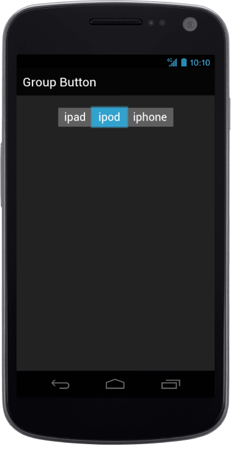

# Select Item

Group Button takes a numeric value given in the selectedItemIndex property and selects the corresponding item that matches the given index. Default value is 0.



@Html.EJMobile().GroupButton("groupbutton_sample").GroupButtonType(GroupButtonType.radio).

SelectedItemIndex(1).Name("options").Buttons(button =>

{

button.Add().Text("ipad");

button.Add().Text("ipod");

button.Add().Text("iphone");

})



The following screenshot displays the Selected Item Index:

