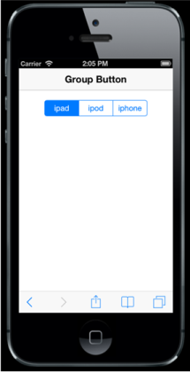

# Type

The Group Button is rendered via button and input tag elements. Group Button rendering is classified into three types: Button type, radio input type, and checkbox input type.

Option 1: Button 



<!-- Group Button : button type -->

@Html.EJMobile().GroupButton("groupbutton_sample").Buttons(button =>

{

button.Add().Text("ipad");

button.Add().Text("ipod");

button.Add().Text("iphone");

})
	   


Option 2: Radio Button



<!-- Group Button : radio type -->

@Html.EJMobile().GroupButton("groupbutton_sample").GroupButtonType(GroupButtonType.

radio).Name("options").Buttons(button =>

{

button.Add().Text("ipad");

button.Add().Text("ipod");

button.Add().Text("iphone");

})
	   


Option 3: Checkbox



<!-- Group Button : checkbox type -->

@Html.EJMobile().GroupButton("groupbutton_sample").GroupButtonType(GroupButtonType.

checkbox).Name("options").Buttons(button =>

{

button.Add().Text("ipad");

button.Add().Text("ipod");

button.Add().Text("iphone");

})



The following screenshot displays the Group Button:

