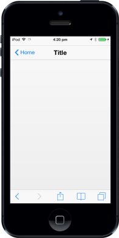
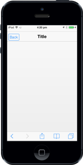

# Customize Left Button

## LeftButtonCaption

To specify the caption (text) for the Header left button, set the “leftbuttoncaption” property. By default, the property value is set to back.


@Html.EJMobile().Header("header_sample").ShowLeftButton(true).LeftButtonCaption("Home")

The following screenshot displays the Left Button Caption:

## LeftButtonStyle

The LeftButtonStyle property specifies the style of the Header left button.

The possible values are, 

1. Back
2. Header
3. Normal



@Html.EJMobile().Header("header_sample").ShowLeftButton(true).LeftButtonStyle(LeftButtonStyle.Normal)


The following screenshot displays the Left Button Style:

## LeftButtonNavigationURL

Specifies the navigation URL of the page while clicking the left button.


@Html.EJMobile().Header("header_sample").ShowLeftButton(true).LeftButtonNavigationUrl("navigation.html")


