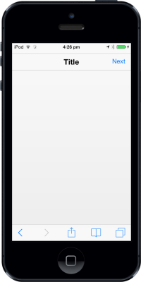

# Customize Right Button                                                     

## RightButtonCaption 

To specify the caption (text) for HeaderRight Button, set “rightbuttoncaption” property. By default, the value is set to “Right”.


@Html.EJMobile().Header("header_sample").ShowRightButton(true).RightButtonCaption("Next")

The following screenshot displays the Right Button Caption:

## RightButtonStyle

The RightButtonStyle property is used to specify the style of the Header right button.

The possible values are, 

1. Header
2. Normal


@Html.EJMobile().Header("header_sample").ShowRightButton(true).RightButtonStyle(RightButtonStyle.Header)

The following screenshot displays the Right Button Style:

## RightButtonNavigationURL

This feature specifies the navigation URL of the page while clicking the right button.


@Html.EJMobile().Header("header_sample").ShowRightButton(true).RightButtonNavigationUrl("")


