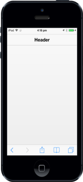

# Title 

To specify the HeaderTitle, set the Title property. By default, the property value is set to Title. Referto the following code example.


@Html.EJMobile().Header("header_sample").Title("Header")      


The following screenshot displays the Title:

