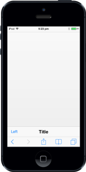
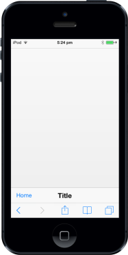

# Customize Left Button

ShowLeftButton

In Footer control, you can view the previous page by using the ShowLeftButton. You can manually enable/disable the button by setting the true/false using ShowLeftButton property.

@Html.EJMobile().Footer("footer_sample").ShowLeftButton(true)

The following screenshot displays the output.

{{ '' | markdownify }}
{:.image }

LeftButtonCaption 

To specify the caption (text) for Footer left button, set LeftButtonCaption property. 

@Html.EJMobile().Footer("footer_sample").ShowLeftButton(true).LeftButtonCaption("Home")

The following screenshot displays the output.

{{ '' | markdownify }}
{:.image }

LeftButtonNavigationURL

Specifies the navigation URL to go to the page when the Left Button is clicked. 

@Html.EJMobile().Footer("footer_sample").ShowLeftButton(true).LeftButtonNavigationUrl("")

