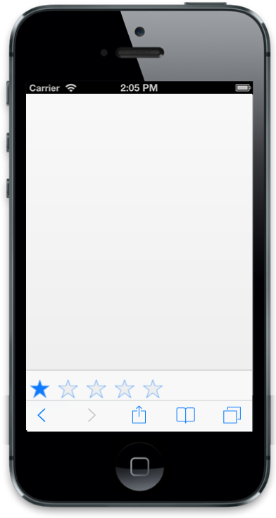

# Customize Right Button

## ShowRightButton

In Footer control, you can view the next page by using the ShowRightButton. You can manually enable/disable the button by setting true/false using ShowRightButton property.



@Html.EJMobile().Footer("footer_sample").ShowRightButton(true)



The following screenshot displays the output.

## RightButtonCaption 

To specify the caption (text) for Footer Right Button, set RightButtonCaption property. 



@Html.EJMobile().Footer("footer_sample").ShowRightButton(true).RightButtonCaption("Next")     



The following screenshot displays the output.

## RightButtonNavigationURL

Specifies the URL to which the page should be navigated when the Right Button is clicked.



@Html.EJMobile().Footer("footer_sample").ShowRightButton(true).RightButtonNavigationUrl("")



## TemplateId

Footer has template support feature. The templateID property is used to define the ID of the template element where you can specify the content to render in the Footer. 



@Html.EJMobile().Footer("footer_sample").TemplateId("template")

 

@Html.EJMobile().Rating("rating") 

 
 
 
 

The following screenshot displays the output.

