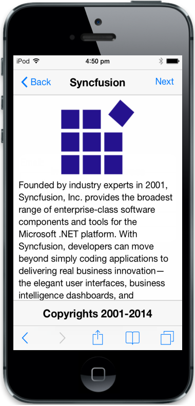
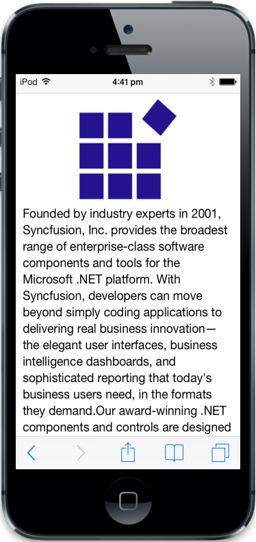
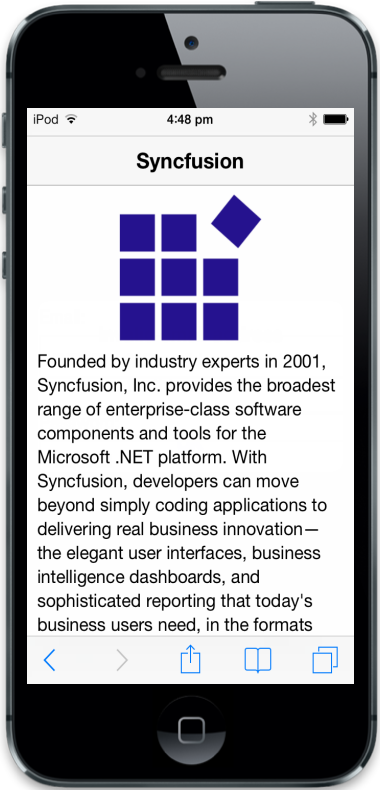
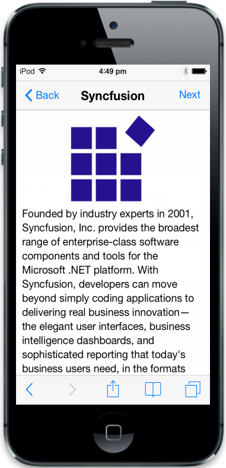
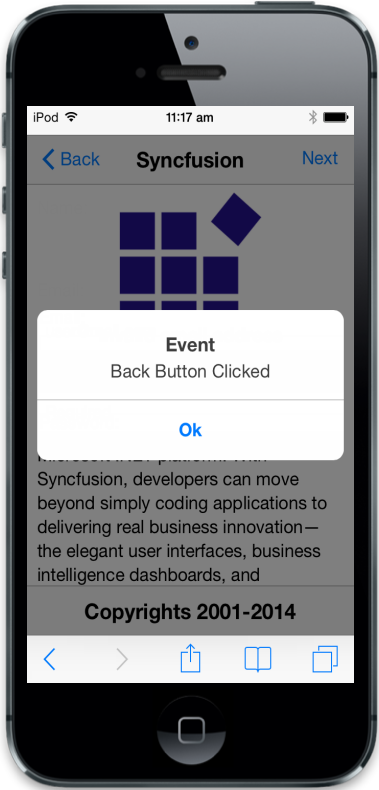
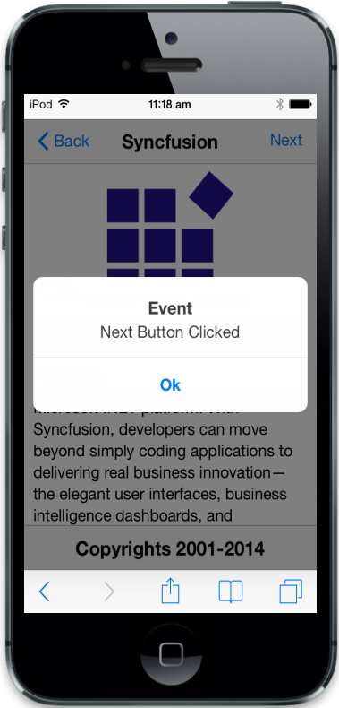

# Getting Started

In this section you will learn how to create Header and Footer in your Mobile app.

## Create your first Header and Footer in MVC

The ASP.NET MVC Mobile Header is placed at the top of the page. It usually contains page title and optional buttons positioned to the left and right for navigation or actions. The position of Header can be fixed according to your requirement. The ASP.NET MVC MobileFooter has the same structure as header but it is at the bottom of the page. You can use the following guidelines to learn about the features in Mobile Header and Footer controls and use it to create a webpage.

## Create the required layout

Header and Footer controls are rendered based on the default values of all the properties. You can customize the Header and Footer controls by changing their properties according to your requirement. You can use the following steps to create a webpage.

Create a simple MVC application and paste the scrollpanel layout page content inside the body tag of layout.cshtml. You can create an MVC Project and add necessary Dlls and scripts with help of the [MVC-Getting Started Documentation](http://help.syncfusion.com/ug/js/default.htm)for Mobile.



       <!-- Add Header control here -->       

        

        
        

        <!-- Adding web page content Here -->

         

                Founded by industry experts in 2001, Syncfusion, Inc. provides the broadest range of enterprise-class software components and tools for the Microsoft .NET platform. With Syncfusion, developers can move beyond simply coding applications to delivering real business innovation—the elegant user interfaces, business intelligence dashboards, and sophisticated reporting that today's business users need, in the formats they demand. Our award-winning.

                .NET components and controls are designed to meet your evolving’ development needs, whether you're working in Windows Forms, WPF, ASP.NET, ASP.NET MVC, or Silverlight.

                At Syncfusion, we uncompromisingly strive for excellence in order to offer the very best value to our customers—from small ISVs to Fortune 100 companies.

        

        

        <!--Scroll Panel-->

@Html.EJMobile().Scrollpanel("header").Target("content")

 <!-- Dialog -->        @Html.EJMobile().Dialog("dialog").Title("Event").LeftButtonCaption("Ok").EnableModal(true).ClientSideEvents(evt => { evt.ButtonTap("dlgclose"); }).Content(@

)

<!-- Add Footer control here -->



Use the following styles to add webpage content element.



 


Run the above code and you can see the following output. 

_Webpage without Header and Footer_

## Create the Header Control

To set Header title, you can set the Title API with the desired heading; in this case, it is set as “Syncfusion”. Refer to the following code example to create the Header control.



@Html.EJMobile().Header("header").Title("Syncfusion")



Run the above code and you can see the following output. 

_Web page with Header_

## Add Header Buttons

To enable HeaderButtons, set the ShowLeftButton and ShowRightButtonAPI values as True. You can set the Button caption using LeftButtonCaption and RightButtonCaptionAPI with the desired caption. For this case, you can set it as Back and Next.



@Html.EJMobile().Header("header").Title("Syncfusion").ShowLeftButton(true).ShowRightButton(true).LeftButtonCaption("Back").RightButtonCaption("Next")



Run the above code and you can see the following output. 

_Header with Buttons_

## Handle Header Button events

You can add functionalities for the left and right Header Buttons by triggering its events using LeftButtonTap and RightButtonTap attributes as follows. When you click the Header Buttons, the respective Button-tap events are triggered. 

<table>
<tr>
<td>
 @Html.EJMobile().Header("header").Title("Syncfusion").ShowLeftButton(true).ShowRightButton(true).LeftButtonCaption("Back").RightButtonCaption("Next").ClientSideEvents(evt=>{ evt.LeftButtonTap("buttonclicked");evt.RightButtonTap("buttonclicked"); })</td></tr>
<tr>
<td>
 </td></tr>
</table>

Run the above code and you can see the following output, when you click the Back and Next buttons respectively. 

<table>
<tr>
<td>
{{ ''| markdownify }}

{{ '_Header left button event_'| markdownify }}</td><td>
{{ ''| markdownify }}

{{ '_Header right button event_'| markdownify }}</td></tr>
</table>

## Create the Footer Control

To set Footer title, set Title API with the desired title. In this case, you can set it as Copyrights 2001-2014. Refer the following code example to create the Footer control.



 @Html.EJMobile().Footer("footer").Title("Copyrights 2001-2014")



Run the above code and you can see the following output. 

_Web page with Header and Footer_

