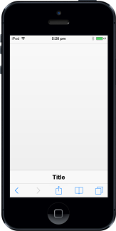

# Position

The Position property is used to customize the Footer Position. You can set the Position property with the following values.

1. Fixed: Specifies whether to keep the Footer in a fixed position of the page
2. Normal: Specifies whether to keep the Footer in a relative position in respect to the page element.

@Html.EJMobile().Footer("footer_sample").Position(FooterPosition.Fixed)

The following screenshot displays the output.

{{ '' | markdownify }}
{:.image }

