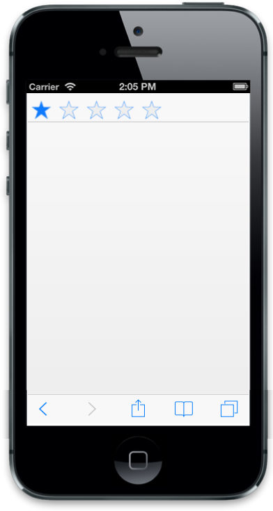

# TemplateId

Template ID is used to define the ID of the template element where you can specify the content to render in the control.



@Html.EJMobile().Header("header_sample").TemplateId("template")

 

@Html.EJMobile().Rating("rating") 

 

 


The following screenshot displays the Template ID:

