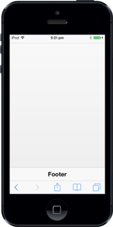

# Title

You can enable/disable the title by using ShowTitle property. Title property is used to set the title text for the Footer.

@Html.EJMobile().Footer("footer_sample").ShowTitle(true).Title("Footer")

The following screenshot displays the output.

{  | markdownify }
{:.image }

