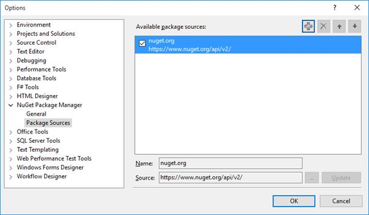

# Installation and Deployment

## Configuring Syncfusion NuGet Packages in Visual Studio 

Syncfusion ASP.NET MVC NuGet packages are available [here](http://nuget.syncfusion.com/package/aspnetmvc).

### NuGet Configuration  

The steps to install the Syncfusion ASP.NET MVC NuGet Packages in Visual Studio are as follows,

1. In Visual Studio, navigate to `Tools | NuGet Package Manager | Package Manager Settings`, the options dialog will appear on the screen as shows below,

   

2. Select `NuGet Package Manager | Package Sources` and click `Add` button to add the `Package Name` and `Package Source` of Syncfusion NuGet Packages.    

   **Name**: Name of the package that listed in Available package sources  
   **Source**: Syncfusion ASP.NET MVC NuGet Package feed url 
   [http://nuget.syncfusion.com/nuget_aspnetmvc/nuget/getsyncfusionpackages/aspnetmvc](http://nuget.syncfusion.com/nuget_aspnetmvc/nuget/getsyncfusionpackages/aspnetmvc)
    
   

   N> The `Source` text box in the above image denotes the location of the NuGet packages and the `Name` section, allows you to provide a unique name for NuGet Packages Source.
    
I> Syncfusion other platforms NuGet packages feed links are available [here](http://nuget.syncfusion.com/)

### NuGet Installation

Syncfusion ASP.NET MVC NuGet can install once configured the package source. The NuGet installation steps as below,

1. Once configured the Package source with Syncfusion NuGet Packages, right click on project and choose `Manage NuGet Packages | Online | <Package Source Name>`.

   

2. The NuGet Packages are listed which are available in package source location. Install the required packages to your application by clicking `Install` button.

   N> NuGet packages can be install directly through the **command line** (Package Manager Console). Further details click [here](http://help.syncfusion.com/extension/syncfusion-nuget-packages/nuget-install-and-configuration#install-from-package-manager-console)

### Updating a NuGet Package

Using the `Manage NuGet Packages` in Visual Studio, NuGet packages can be update.
 
1. Right click on Project and Navigate to the `Manage NuGet Packages` and click on the `Updates` tab to check for updates.

2. Select the `Updates -> <Syncfusion Package Source>`. Refer to the following screenshot for more information.

   

3. If there is a new version of NuGet you will see it in the list of available updates.

4. Select NuGet Package in the list and click `Update`. When the update is complete, close and re-open all open instances of Visual Studio.

   N> By clicking `Update All` button, all NuGet packages are getting update. When the update is complete, close and re-open all open instances of Visual Studio.

