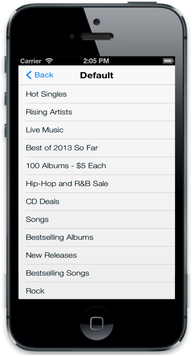
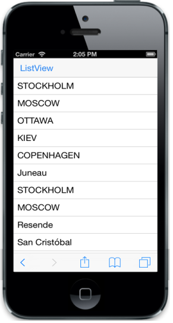
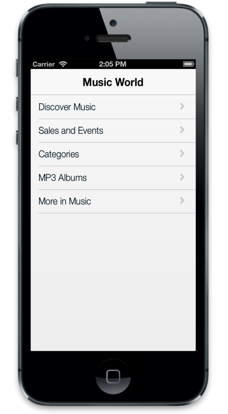
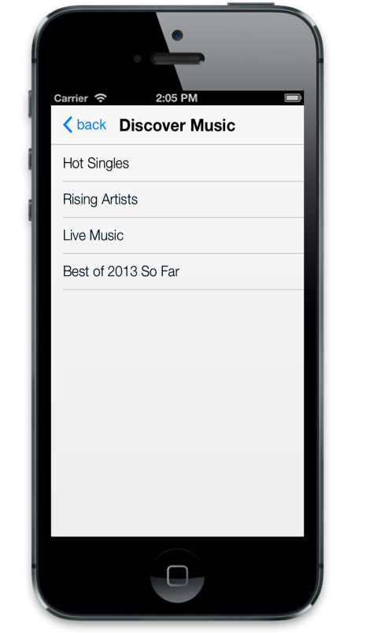

# Data Binding

## Local Data Binding

Essential Studio mobile JS ListView provides support for Data Binding. Data Binding provides a simple and consistent way for applications to present and interact with data. Elements can be bounded to data from a variety of data sources. In local Data Binding, the data source is written inside the program. Then it is handled by the ListView control. By using DataBinding property, you can enable Data Binding. DataSource is used to get the data source that holds the list items.

For MVC Wrapper sample, create a model file for Data Binding. Add the following model code to a CS file and save it as ListLocalData.cs.



    public class ListLocalData

    {

        public string texts { get; set; }

    }  

    public static class ListLocalDataModal

    {

        public static List<ListLocalData> listSource = new List<ListLocalData>();      

        public static List<ListLocalData> setListSource()

        {

            listSource.Add(new ListLocalData { texts = "Hot Singles"});

            listSource.Add(new ListLocalData { texts = "Rising Artists"});

            listSource.Add(new ListLocalData { texts = "Live Music"});

            listSource.Add(new ListLocalData { texts = "Best of 2013 So Far"});

            listSource.Add(new ListLocalData { texts = "100 Albums - $5 Each"});

            listSource.Add(new ListLocalData { texts = "Hip-Hop and R&B Sale"});

            listSource.Add(new ListLocalData { texts = "CD Deals"});

            listSource.Add(new ListLocalData { texts = "Songs"});

            listSource.Add(new ListLocalData { texts = "Bestselling Albums"});

            listSource.Add(new ListLocalData { texts = "New Releases"});

            listSource.Add(new ListLocalData { texts = "Bestselling Songs"});

            listSource.Add(new ListLocalData { texts = "Rock"});

            listSource.Add(new ListLocalData { texts = "Gospel" });

            listSource.Add(new ListLocalData { texts = "Jazz"});

            listSource.Add(new ListLocalData { texts = "Music Trade-In"});

            listSource.Add(new ListLocalData { texts = "Redeem a Gift Card"});

            listSource.Add(new ListLocalData { texts = "Band T-Shirts"});

            listSource.Add(new ListLocalData { texts = "Mobile MVC"});

            return listSource;

        }

        public static void clearSource()

        {

            listSource.Clear();

        }       

    }

You have to modify the controller as a model is added to the sample. Modify the controller as follows.

        public ActionResult LocalDataBinding()

        {

            ListLocalDataModal.clearSource();

            return View(ListLocalDataModal.setListSource());

        }



For example, use the following code example to give you the exact output.



@model List<ListLocalData>

@{

    @Html.EJMobile().ListView("localListView").ShowHeader(true).HeaderTitle("Default").ShowHeaderBackButton(true).DataBinding(true).DataSource(Model).FieldSettings(f => f.Text("texts"));

}



The following screenshot displays the Local Data Binding:

## Remote Data Binding

In RemoteData Binding, the data is retrieved from a particular URL unlike the local Data Binding and then it is handled by the ListView control. By using DataBinding property, you can enable Data Binding. DataSource is used to get the data that holds the list items.



@{

    @Html.EJMobile().ListView("remoteListBox").ShowHeader(true).HeaderTitle("Data Binding Remote").ShowHeaderBackButton(true).DataBinding(true).DataSource(d => d.URL("http://mvc.syncfusion.com/Services/Northwnd.svc/")).Query("ej.Query().from('Orders').select('ShipCity').take(5)").FieldSettings(f =>

{

    f.Text("ShipCity");

});

}



The following screenshot displays the remote Data Binding:

## FieldSettings

FieldSettings property is used to map the DataSource field with the list item fields. In addition to the list item specific properties, the following fields are available while mapping.

<table>
<tr>
<th>
Properties</th><th>
Definition</th></tr>
<tr>
<td>
ParentPrimaryKey</td><td>
In DB, you can relate any child item to some other item. ‘PrimaryKey’ is used to set the parent item. ‘ParentPrimaryKey’ defines the ‘PrimaryKey’ of some parent items to identify which item is its parent.</td></tr>
<tr>
<td>
Attributes</td><td>
In DB, you can define the desired class name or styles for the list item through ‘Attributes’ field.</td></tr>
</table>



@model List<FieldSettingsData>

@{

    @Html.EJMobile().ListView("localListBox").ShowHeader(true).HeaderTitle("Music World").DataBinding(true).DataSource(Model).FieldSettings(f =>

{

    f.Text("texts").PrimaryKey("primaryKeys").ParentPrimaryKey("parentPrimaryKeyss").ChildHeaderTitle("Title").ChildHeaderBackButtonText("BackIconText");

});

}



The following screenshots display the Field Settings:

## Query

This feature in the ListView is used to fetch data from the DataSource before listing them. A Query is a constraint that is used to take only the data defined through Query.



@{

    @Html.EJMobile().ListView("remoteListBox").DataBinding(true).DataSource(d => d.URL("http://mvc.syncfusion.com/Services/Northwnd.svc/")).Query("ej.Query().from('Orders').select('ShipCity').take(5)").FieldSettings(f =>

{

    f.Text("ShipCity");

});

}



