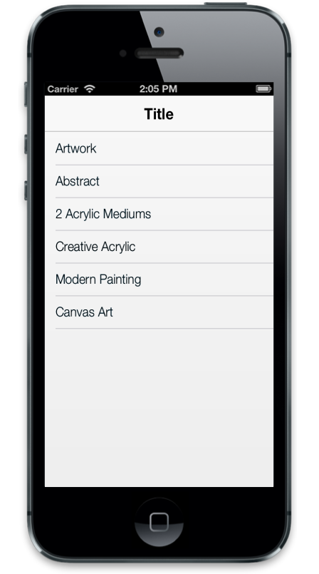

## Dimensions

To customize the ListView dimensions, Width and Height properties are used.

@Html.EJMobile().ListView("lb").Height(300).ShowHeader(false).Items(items =>

{

    items.Add().Text("ArtWork");

    items.Add().Text("Abstract");

    items.Add().Text("2 Acrylic Mediums");

    items.Add().Text("Creative Acrylic");

    items.Add().Text("Modern Painting");

    items.Add().Text("Canvas Art");

    items.Add().Text("Black white");

    items.Add().Text("Children");

    items.Add().Text("Preschool Crafts");

    items.Add().Text("School-age Crafts");

})

The following screenshot displays the Dimensions:

{  | markdownify }
{:.image }

AutoAdjustScrollHeight

The AutoAdjustScrollHeight is a Boolean property that lets you adjust the scrolling content height automatically in case you have “ejm” elements with fixed position in your application. Default value is set to true.

@Html.EJMobile().ListView("lb").AllowScrolling(true).AutoAdjustScrollHeight(true).ShowHeader(false).Items(items =>

{

    items.Add().Text("ArtWork");

    items.Add().Text("Abstract");

    items.Add().Text("2 Acrylic Mediums");

    items.Add().Text("Creative Acrylic");

    items.Add().Text("Modern Painting");

    items.Add().Text("Canvas Art");

    items.Add().Text("Black white");

    items.Add().Text("Children");

    items.Add().Text("Preschool Crafts");

    items.Add().Text("School-age Crafts");

})

AutoAdjustHeight

When the AutoAdjustHeight property is set to true, it sets the Height of the list element automatically based on the window height. Default value is set to false.

@Html.EJMobile().ListView("lb").AutoAdjustHeight(true).ShowHeader(false).Items(items =>

{

    items.Add().Text("ArtWork");

    items.Add().Text("Abstract");

    items.Add().Text("2 Acrylic Mediums");

    items.Add().Text("Creative Acrylic");

    items.Add().Text("Modern Painting");

    items.Add().Text("Canvas Art");

    items.Add().Text("Black white");

    items.Add().Text("Children");

    items.Add().Text("Preschool Crafts");

    items.Add().Text("School-age Crafts");

})

