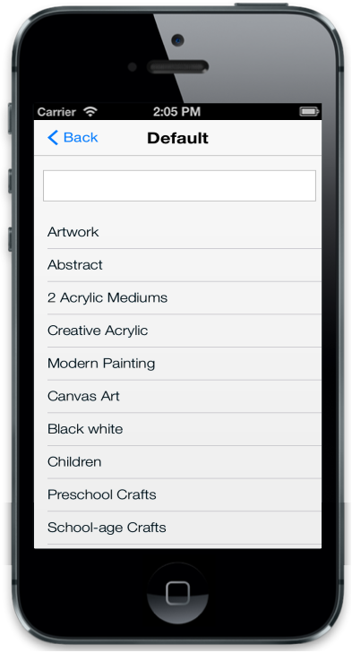
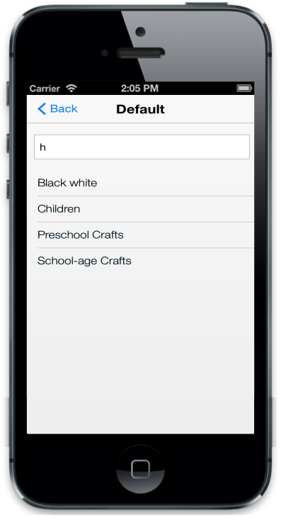

## Filtering

Filtering is one of the key features in the ListView control. Filtering option is added into the ListView control when the EnableFiltering property is set to true. This enables a simple interface to filter items from a large collection of ListView items.

@Html.EJMobile().ListView("lb").ShowHeader(true).HeaderTitle("Default").ShowHeaderBackButton(true).EnableFiltering(true).Items(items => {    

    items.Add().Text("ArtWork");

    items.Add().Text("Abstract");

    items.Add().Text("2 Acrylic Mediums");

    items.Add().Text("Creative Acrylic");

    items.Add().Text("Modern Painting");

    items.Add().Text("Canvas Art");

    items.Add().Text("Black white");

    items.Add().Text("Children");

    items.Add().Text("Preschool Crafts");

    items.Add().Text("School-age Crafts");

})

The following screenshots display the Filtering:

{{ '' | markdownify }}
{:.image }

{{ '' | markdownify }}
{:.image }

