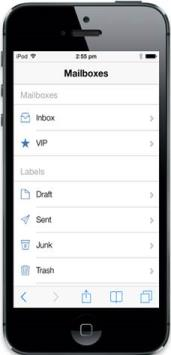
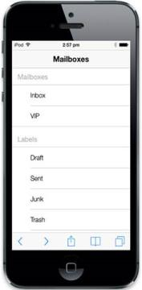
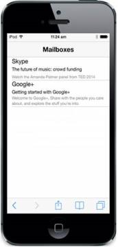

# Getting Started

This section explains briefly on how to create a ListView control in your application.

## Create your first ListView in MVC

EssentialASP.NET MVC Mobile Listview widget is used to build an interactive list view interface. It allows you to select an item from a list-like interface and provides the infrastructure to display a set of data items in different layouts or views. Lists are used for displaying data, data navigation, result lists, and data entry.

{  | markdownify }
{:.image }

The following steps help you add a ListView control.

Create Basic Mobile Layout 

Refer [MVC-Getting Started Documentation](http://help.syncfusion.com/ug/js/default.htm) to create an MVC Project, add necessary Dll’s and Scripts.

Add the following code inside the &lt;body&gt; tag in the Layout.cshtml page.

&lt; !---Add Header Here  ---&gt; 

&lt;div&gt;

    @RenderBody()

&lt;/div&gt;

Create ListView for Mail App

To add Listview control, you need to call ListView helper.                 

 Refer the following code example.

&lt;div id="content"&gt;

            @Html.EJMobile().ListView("grouplistsamp")

            &lt;!-- Add Listview Items Here --&gt;

&lt;/div&gt;

Create Grouped List

Set EnableGroupList property to “True”. You can provide individual header title for each group, by setting the Title property for every group item. Refer the following code example.

   @Html.EJMobile().ListView("grouplistsamp").ShowHeader(true).HeaderTitle("MailBoxes").EnableGroupList(true).Groups(gp =>

    {

        gp.Add().Title("Mailboxes").Items(grplist1 =>

        {

            grplist1.Add().Text("Inbox");

            grplist1.Add().Text("VIP");

        });

        gp.Add().Title("Labels").Items(grplist2 =>

        {

            grplist2.Add().Text("Draft");

            grplist2.Add().Text("Sent");

            grplist2.Add().Text("Junk");

            grplist2.Add().Text("Trash");

            grplist2.Add().Text("All mails");

            grplist2.Add().Text("Mail");

        });

    });

Run the above code and you can see the following output. For queries on how to run, you refer this [link](http://help.syncfusion.com/ug/js/default.htm).

{  | markdownify }
{:.image }

Add Images to ListView

Specify the image class name for individual items using the ImageClass propertyin every item as follows.

@Html.EJMobile().ListView("grouplistsamp").ShowHeader(true).HeaderTitle("MailBoxes").EnableGroupList(true).Groups(gp =>

    {

        gp.Add().Title("Mailboxes").Items(grplist1 =>

        {

            grplist1.Add().Text("Inbox").ImageClass("icn-inbox");

            grplist1.Add().Text("VIP").ImageClass("icn-vip");

        });

        gp.Add().Title("Labels").Items(grplist2 =>

        {

            grplist2.Add().Text("Draft").ImageClass("icn-draft");

            grplist2.Add().Text("Sent").ImageClass("icn-sent");

            grplist2.Add().Text("Junk").ImageClass("icn-junk");

            grplist2.Add().Text("Trash").ImageClass("icn-trash");

            grplist2.Add().Text("All mails").ImageClass("icn-mails");

            grplist2.Add().Text("Mail").ImageClass("icn-mail");

        });

    })

&lt;style&gt;

    &lt;!--Add image style here--&gt;

&lt;/style&gt;

You can define the image classes specified for the ListView items as follows.

&lt;style type="text/css"&gt;

            [class*="icn-"] {

                background-image: url("http://js.syncfusion.com/ug/mobile/content/listview/sprite.png");

                background-repeat: no-repeat;

            }

            .icn-inbox {

                background-position: 0 -157px;

            }

            .icn-vip {

                background-position: 0 -530px;

            }

            .icn-draft {

                background-position: 0 -78px;

            }

            .icn-sent {

                background-position: 0 -372px;

            }

            .icn-junk {

                background-position: 0 -227px;

            }

            .icn-trash {

                background-position: 0 -157px;

            }

            .icn-allmail {

                background-position: 0 0;

            }

            .icn-mail {

                background-position: 0 -297px;

            }

&lt;/style&gt;

Run the above code and you can see the following output. For queries on how to run please refer this [link](http://help.syncfusion.com/ug/js/default.htm).

{  | markdownify }
{:.image }

Create Child List with Template

To view the inbox messages, after creating the ListView, you can add its ChildList items. Since the ChildList contains the detailed mail information, you can add its content through Template Support, and by that you can customize the appearance of the list items. Specify the Rendertemplate property to achieve this.

@Html.EJMobile().ListView("grouplistsamp").ShowHeader(true).HeaderTitle("MailBoxes").EnableGroupList(true).Groups(gp =>

    {

        gp.Add().Title("Mailboxes").Items(grplist1 =>

        {

            grplist1.Add().Text("Inbox").ChildHeaderTitle("Mailboxes").ImageClass("icn-inbox").Children(child =>

            {

                child.Add().RenderTemplate(true).ContentTemplate(@&lt;div&gt;

                    &lt;!--User Template Code for child item1. Code given in next step --&gt;

                &lt;/div&gt;);

                child.Add().RenderTemplate(true).ContentTemplate(@&lt;div&gt;

                    &lt;!--User Template Code for child item2. Code given in next step --&gt;

                &lt;/div&gt;);

            });

            grplist1.Add().Text("VIP").ImageClass("icn-vip");

        });

        gp.Add().Title("Labels").Items(grplist2 =>

        {

            grplist2.Add().Text("Sound").ImageClass("icn-draft");

            grplist2.Add().Text("Sent").ImageClass("icn-sent");

            grplist2.Add().Text("Junk").ImageClass("icn-junk");

            grplist2.Add().Text("Trash").ImageClass("icn-trash");

            grplist2.Add().Text("All mails").ImageClass("icn-mails");

            grplist2.Add().Text("Mail").ImageClass("icn-mail");

        });

    })

&lt;style&gt;

  &lt;!--Add Content style here--&gt;

&lt;/style&gt;

You can use the following code example to add a customized template within a list item.

  &lt;div class="mailcontentdiv"&gt;

    &lt;div class="titlediv"&gt;

        Skype

    &lt;/div&gt;

    &lt;div class="subjectdiv"&gt;

        The future of music: crowd funding

    &lt;/div&gt;

    &lt;div class="contentdiv"&gt;

        Watch the Amanda Palmer panel from TED 2014

    &lt;/div&gt;

&lt;/div&gt;

&lt;div class="mailcontentdiv"&gt;

    &lt;div class="titlediv"&gt;

        Google+

    &lt;/div&gt;

    &lt;div class="subjectdiv"&gt;

        Getting started with Google+

    &lt;/div&gt;

    &lt;div class="contentdiv"&gt;

        Welcome to Google+, Share with the people you care about, and explore the stuff

        you're into.

    &lt;/div&gt;

&lt;/div&gt;

You can use the following styles to add custom style to the template content.

&lt;!—Add Content Style Here--&gt;

&lt;style type="text/css"&gt;

     .mailcontentdiv, .contentdiv, .subjectdiv, .titlediv {

        display: inline-block;

        padding:5px;

    }

    .contentdiv {

        font-size: 12px;

        color: gray;

    }

    .subjectdiv {

        font-size: 14px;

    }

    .titlediv {

        font-size: 18px;

    }

&lt;/style&gt;

In this example, you can move to the inbox page by tapping inbox list item to render the child items in inbox.            

Run the above code and you can see the following output. For queries on how to run, refer this [link](http://help.syncfusion.com/ug/js/default.htm).

{  | markdownify }
{:.image }

From the above steps, you have learnt how to create Essential MVC Mobile ListView widget with use case samples. There are more customization properties, other than the ones used here. To know more about the properties in Mobile ListView widget, you can refer the complete documentation page for Mobile ListView widget.

