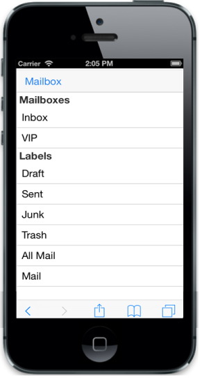
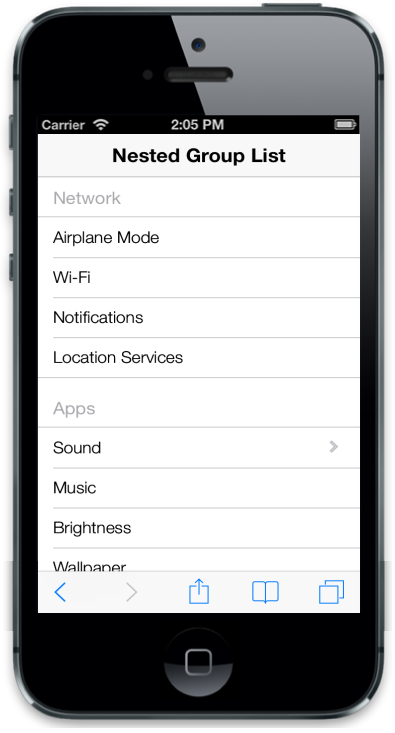

# Grouped List

## First level group list

The ListView widget makes a grouped list when ‘EnableGroupList’ property is set to true. This groups the set of items listed under ul. The grouped item is identified with the header title specified.



@Html.EJMobile().ListView("firstlevelgrouplist").ShowHeader(true).HeaderTitle("First Level Group List").EnableGroupList(true).Groups(gp =>

    {

        gp.Add().Title("Network").Items(items =>

    {

        items.Add().Text("Airplane_Mode");

        items.Add().Text("Wi-Fi");

        items.Add().Text("Notifications");

        items.Add().Text("Location_Services");

    });

        gp.Add().Title("Apps").Items(items =>

    {

        items.Add().Text("Sound");

        items.Add().Text("Brightness");

        items.Add().Text("Wallpaper");

    });

        gp.Add().Title("Settings").Items(items =>

    {

        items.Add().Text("General");

        items.Add().Text("Brightness");

        items.Add().Text("Wallpaper");

    });

    })



The following screenshot displays the first level group list:

## Nested Child group list

While selecting a list item that is grouped, you can render another set of list items. This is achieved by defining the desired child item list within the list containing ‘PrimaryKeyValue’. This PrimaryKeyValue property relates the parent child for identifying its appropriate child when clicking on the parent list item.



@Html.EJMobile().ListView("grouplistsamp").ShowHeader(true).HeaderTitle("Nested Level Group List").EnableGroupList(true).Groups(gp =>

    {

        gp.Add().Title("Network").Items(items =>

    {

        items.Add().Text("Airplane_Mode");

        items.Add().Text("Wi-Fi");

        items.Add().Text("Notifications");

        items.Add().Text("Location_Services");

    });

        gp.Add().Title("Apps").Items(items =>

    {

        items.Add().Text("Sound").PrimaryKey(1).Children(child =>

            {

                child.Add().Text("Ring Tone");

                child.Add().Text("Message Tone");

                child.Add().Text("Notification Tone");

            });

        items.Add().Text("Brightness");

        items.Add().Text("Wallpaper");

    });

        gp.Add().Title("Settings").Items(items =>

    {

        items.Add().Text("General");

        items.Add().Text("Brightness");

        items.Add().Text("Wallpaper");

    });

    })



The following screenshot displays the Nested Child Group List:

