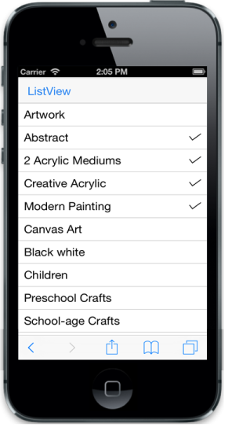
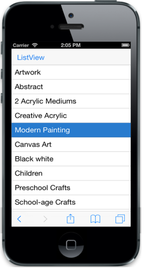

# Selection

## MultiSelection

ListView has a check list feature that is used to select multiple list items at the same time in the ListView. For this, set EnableCheckMark to true.



@Html.EJMobile().ListView("lb").EnableCheckMark(true).ShowHeader(true).HeaderTitle("ListView").Items(items => {    

    items.Add().Text("ArtWork");

    items.Add().Text("Abstract");

    items.Add().Text("2 Acrylic Mediums");

    items.Add().Text("Creative Acrylic");

    items.Add().Text("Modern Painting");

    items.Add().Text("Canvas Art");

    items.Add().Text("Black white");

    items.Add().Text("Children");

    items.Add().Text("Preschool Crafts");

    items.Add().Text("School-age Crafts");

})



The following screenshot displays Multiselection:

## PreventSelection

When a specific list item is selected, it is highlighted with an active color. PreventSelection property prevents this behavior when set to true. 

> Note: When the click (select) action is completed, the highlight is undone automatically even if this property is set to false.



@Html.EJMobile().ListView("lb").PreventSelection(true).Items(items => {    

    items.Add().Text("ArtWork");

    items.Add().Text("Abstract");

    items.Add().Text("2 Acrylic Mediums");

    items.Add().Text("Creative Acrylic");

    items.Add().Text("Modern Painting");

    items.Add().Text("Canvas Art");

    items.Add().Text("Black white");

    items.Add().Text("Children");

    items.Add().Text("Preschool Crafts");

    items.Add().Text("School-age Crafts");

})



## PersistSelection

PersistSelection property is used to highlight the selected item in the ListView control even after touch end happens. By default, the active state is removed once touch end happens.



@Html.EJMobile().ListView("lb").PersistSelection(true).ShowHeader(true).HeaderTitle("ListView").Items(items => {    

    items.Add().Text("ArtWork");

    items.Add().Text("Abstract");

    items.Add().Text("2 Acrylic Mediums");

    items.Add().Text("Creative Acrylic");

    items.Add().Text("Modern Painting");

    items.Add().Text("Canvas Art");

    items.Add().Text("Black white");

    items.Add().Text("Children");

    items.Add().Text("Preschool Crafts");

    items.Add().Text("School-age Crafts");

})



The following screenshot displays Persist Selection:

