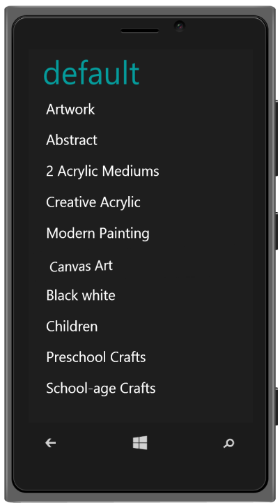

## Windows Specific Customization

You can set the Windows Specific properties to the control by accessing Windows property. PreventSkew property is used to disable the skewing effect while clicking on the list item. 

@Html.EJMobile().ListView("lb").RenderMode(RenderMode.Windows).Windows(windows => { windows.PreventSkew(true); }).Items(items =>

{    

    items.Add().Text("ArtWork");

    items.Add().Text("Abstract");

    items.Add().Text("2 Acrylic Mediums");

    items.Add().Text("Creative Acrylic");

    items.Add().Text("Modern Painting");

    items.Add().Text("Canvas Art");

    items.Add().Text("Black white");

    items.Add().Text("Children");

    items.Add().Text("Preschool Crafts");

    items.Add().Text("School-age Crafts");

})

The following screenshot displays the Windows Specific Customization:

{  | markdownify }
{:.image }

