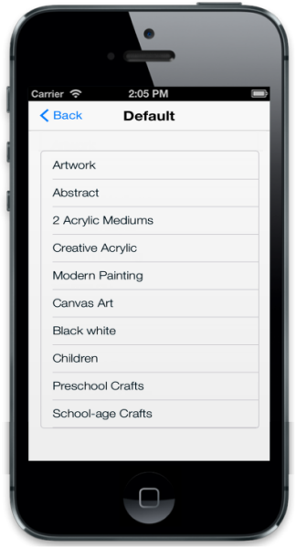

## iOS7 Specific Customization

You can set the iOS7 specific properties to the control by accessing iOS7 property. The Inline property provides inline appearance for the ListView control and displays the ListView with rounded corners.

@Html.EJMobile().ListView("lb").ShowHeader(true).HeaderTitle("Default").ShowHeaderBackButton(true).RenderMode(RenderMode.IOS7).IOS7(ios7 => { ios7.Inline(true); }).Items(items =>

{    

    items.Add().Text("ArtWork");

    items.Add().Text("Abstract");

    items.Add().Text("2 Acrylic Mediums");

    items.Add().Text("Creative Acrylic");

    items.Add().Text("Modern Painting");

    items.Add().Text("Canvas Art");

    items.Add().Text("Black white");

    items.Add().Text("Children");

    items.Add().Text("Preschool Crafts");

    items.Add().Text("School-age Crafts");

})

The following screenshot displays the iOS7 Specific Customization:

{  | markdownify }
{:.image }

