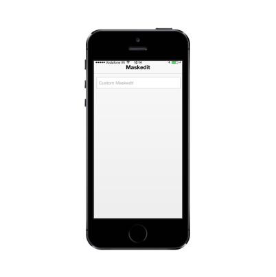

# Customize watermark text

WatermarkText property is used in customizing the text that appears in the background of your MaskEdit Textbox. It acts like a label for the MaskEdit Textbox.

Refer to the following code example.



@Html.EJMobile().MaskEdit("maskedit_sample").WatermarkText("Custom Maskedit").Mask("+1 (999) 999-9999")   



