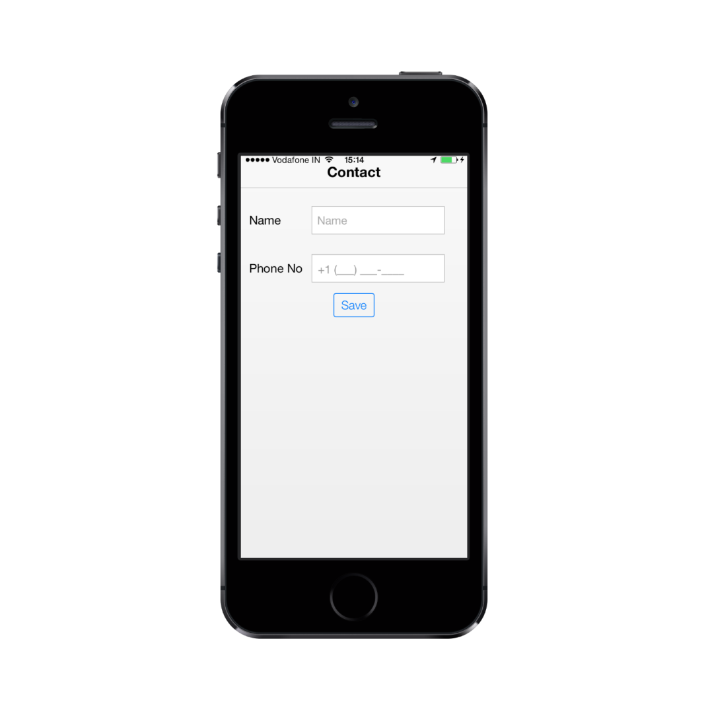

# Getting Started

## Create your first MaskEdit Widget in MVC

Essential JavaScript Mobile MaskEdit control allows you to enter input with standard format. From the following guidelines, you can learn how to create a MaskEdit control for adding a contact.

### Create the layout

Create a MVC application and add the following code example in the <body> tag of layout.cshtml file.

You can create a MVC project and add necessary DLL’s and scripts with the help of the [MVC Getting Started Documentation.](http://help.syncfusion.com/js/)



@Html.EJMobile().Header("header").Title("Contact").Position(MobileHeaderPosition.Normal)

<table class="editors">

<tbody>

<tr>

<td>

<label>

Name

</label>

</td>

<td>

<!--Textbox control-->

@Html.EJMobile().TextBox("textbox_sample").WatermarkText("Name")                            

</td>

</tr>

<tr>

<td>

<label>

Phone No

</label>

</td>

<td>

<!--Add Maskedit Control-->

</td>

</tr>

</tbody>

</table>

<!--Button Control-->

@Html.EJMobile().Button("button").Text("Save")                    



### Add MaskEdit Control



@Html.EJMobile().MaskEdit("maskedit_sample").WatermarkText("Maskedit").Mask("+1 (999) 999-999")



Run the code and get the following output.

