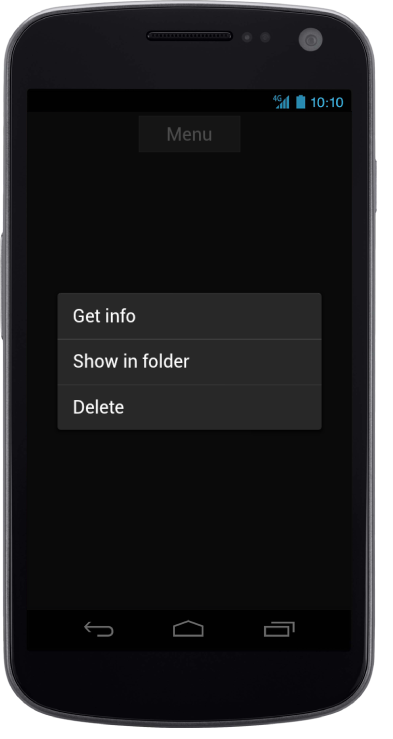

#Android Specific Customization

Set the Android Specific properties to the control by accessing “Android” property.

## Type

When you click a button or target element, the Menu appears in contextual or popup mode. The appearance of the Menu is defined by Type property. 

The possible values are, 

1. Contextual 
2. Popup
3. Optionmenu
4. Optionslist



    

        @Html.EJMobile().Button("menuitem").Text("Menu").RenderMode(RenderMode.Android)

    

    @Html.EJMobile().Menu("menu_sample").TargetId("menuitem").RenderMode(RenderMode.Android).Android(android=>android.Type(AndroidMenuType.Contextual)).Items(item =>

            {

                item.Add().Text("Get info");

                item.Add().Text("Show in folder");

                item.Add().Text("Delete");

            })
			


The following screenshot displays the Android-specific Type:

