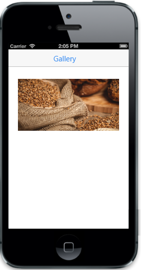
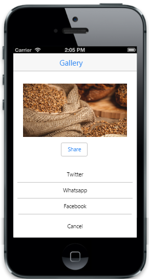
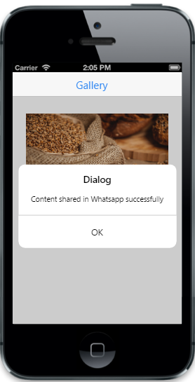

# Getting started

This section explains you on how to create a Menu using Essential ASP.NET MVC and how to use it in your application.

## Create your first Menu in MVC

The ASP.NET MVC Mobile Menu provides you an interface to easily navigate hierarchical data.  In the following section, you can learn to create a Gallery app and learn the features in Menu widget. 

## Create the required layout for gallery app

The ASP.NET MVC Mobile Menu widget can be rendered from a hierarchy of <ul> and <li> and can perform unique actions based on the properties given for each <li> item. You can easily customize the Menu control by changing its properties. In the following code example, the gallery app menu is used to show multiple sharing options to share images.

Create a simple MVC application and paste the following header and scrollpanel layout page content inside the <body>tag of layout.cshtml. You can create a MVC Project and add necessary Dll’s and Scripts with the help of the [MVC Getting Started Documentation](https://help.syncfusion.com/aspnetmvc/getting-started) and add the following code example in the <body> tag of Layout.cshtml file.



    

        <!-- header helper -->
        @Html.EJMobile().NavigationBar("menuitems").Title("Gallery")

        

            

                <!-- Render Menu control -->

            

        

        <!-- ScrollPanel helper -->
        @Html.EJMobile().Scrollpanel("scroll").Target("content")

    



To create a Menu, add the following code example to the corresponding view page.



<!-- Add Gallery image -->

<!-- dialog helper -->

@Html.EJMobile().Dialog("alertdlg").Title("Dialog").EnableAutoOpen(false).LeftButtonCaption("OK").ClientSideEvents(events => { events.ButtonTap("alertClose"); }).Content(@

)

<!—Add Menu helper here-->



Execute the above code to render the following output.

Gallery App with Share button
{:.caption}

## Create the Menu control

To render the Menu control, you need to call Menu helper. Menu can be displayed with or without a title. In this example, a title is not required,'ShowTitle' property to false. By using 'Text' property, you can set text for menu items. Refer to the following code example. 

Refer to the following code example.



 <!-- Menu helper -->

 @Html.EJMobile().Menu("menuitem").ShowTitle(false).Items(items =>
                {

                    items.Add().Text("Twitter");

                    items.Add().Text("Whatsapp");

                    items.Add().Text("Facebook");
                })
 



Add the below styles


        .appview.e-m-windows.e-m-light {
            background: none repeat scroll 0 0 #eee;
        }



## Show the Menu

You can click the share button present in the header to display the Menu. Yo u can achieve this by setting the targetid property as share button’s id. 

Refer to the following code example.



                    @Html.EJMobile().Button("menu_target").Text("Share")

                    @Html.EJMobile().Menu("menuitem").ShowTitle(false).Target("menu_target").Items(items =>
                {

                    items.Add().Text("Twitter");

                    items.Add().Text("Whatsapp");

                    items.Add().Text("Facebook");
                })



Execute the above code and the following output displays when you click the share button.

## Handle Menu events

You can add functionalities for each Menu item by setting the TouchEnd event. When you click a particular menu item, its corresponding touchend event is triggered and it can be handled as shown in the following code example.



<!-- Menu helper -->        
  @Html.EJMobile().Menu("menuitem").ShowTitle(false).Target("menu_target").ClientSideEvents(events => { events.TouchEnd("showDialog"); }).Items(items =>
                {

                    items.Add().Text("Twitter");

                    items.Add().Text("Whatsapp");

                    items.Add().Text("Facebook");
                })

  

 
 
     


Execute the above code and the following output displays when you click the particular Menu item present in the Menu control.

