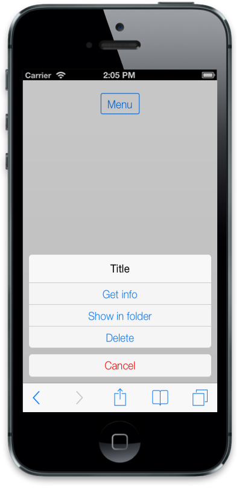
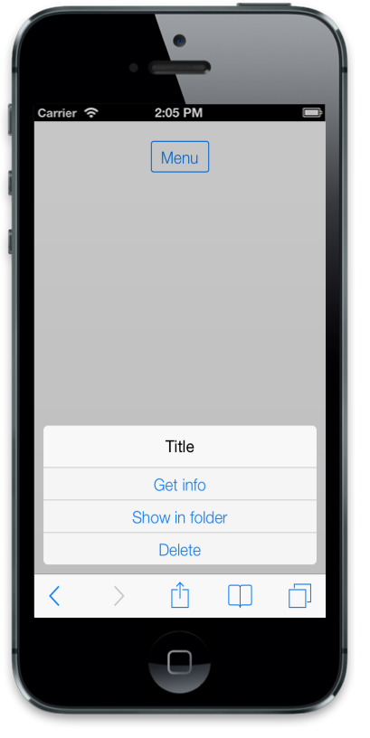
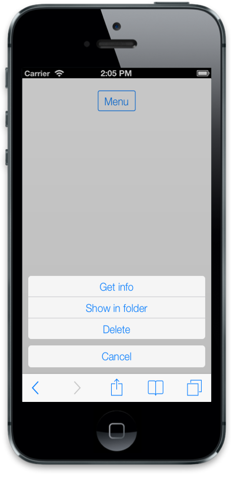
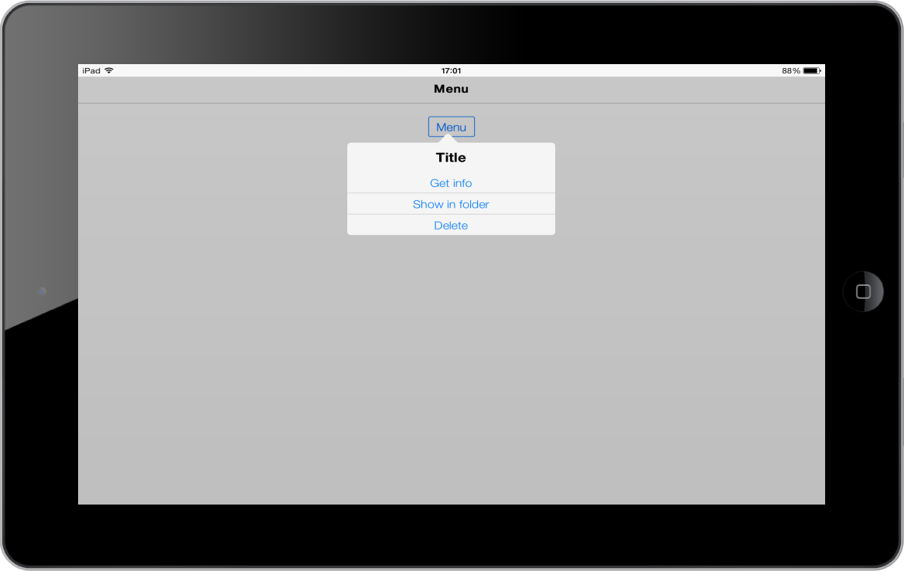

# IOS7 Specific Customization

You can set the iOS7 specific properties to the control by accessing iOS7 property.

## Cancel Button Customization

## Text and Color

The iOS7 Animate Type Menu comes with CancelButton at the bottom. The Cancel Button color can be customized by CancelButtonColor property. The Cancel Button text is changed by using CancelButtonText property. Set the desired text by using this property.



@Html.EJMobile().Button("menuitem").Text("Menu").RenderMode(RenderMode.IOS7)

@Html.EJMobile().Menu("menu_sample").TargetId("menuitem").IOS7(ios7=>ios7.CancelButtonColor(IOS7ButtonColor.Red).CancelButtonText("Cancel")).Items(item =>

{

item.Add().Text("Get info");

item.Add().Text("Show in folder");

item.Add().Text("Delete");

})



The following screenshot displays the Button Customization:

## Hide Cancel Button

You can hide or show the Cancel Button by setting false or true to the ShowCancelButton property.



@Html.EJMobile().Button("menuitem").Text("Menu").RenderMode(RenderMode.IOS7)

@Html.EJMobile().Menu("menu_sample").TargetId("menuitem").IOS7(ios7=>ios7.ShowCancelButton(false)).Items(item =>

{

item.Add().Text("Get info");

item.Add().Text("Show in folder");

item.Add().Text("Delete");

})
			


The following screenshot displays the Show Cancel Button:

## Title

When iOS7 Menu is used, it comes up with a Title on the top of the Menu container. You can hide or show the Title by setting false or true by using ShowTitle property. You can also change the Title text by setting the desired Title for Title property.



@Html.EJMobile().Button("menuitem").Text("Menu").RenderMode(RenderMode.IOS7)

@Html.EJMobile().Menu("menu_sample").TargetId("menuitem").IOS7(ios7=>ios7.ShowTitle(false)).Items(item =>

{

item.Add().Text("Get info");

item.Add().Text("Show in folder");

item.Add().Text("Delete");

})



The following screenshot displays the Title:

## Type

When you click a button or a target element, the Menu is shown. The appearance of the Menu is defined by the Type property. The possible values are,

1. Animate-This Menu is rendered in phone mode.
2.  Normal-This Menu is rendered in tablet mode.
3. Auto-This mode automatically updates the MenuType based on the mode of iOS7 device whether it is phone or tablet mode.



@Html.EJMobile().Button("menuitem").Text("Menu").RenderMode(RenderMode.IOS7)

@Html.EJMobile().Menu("menu_sample").TargetId("menuitem").IOS7(ios7=>ios7.Type(IOS7MenuType.Normal)).Items(item =>

{

item.Add().Text("Get info");

item.Add().Text("Show in folder");

item.Add().Text("Delete");

})



The following screenshot displays the Type:

