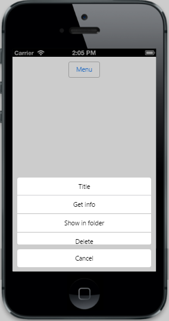

# Scrolling 	

The AllowScrolling property defines whether to allow the scrolling behavior or not when the number of Menu items exceed the specified Menu height.The default value of allowscrolling  property  is true.


	

	@Html.EJMobile().Button("menuitem").Text("Menu")

	

@Html.EJMobile().Menu("menu_sample").Target("menuitem").Height("200").Items(item =>
    {

        item.Add().Text("Get info");

        item.Add().Text("Show in folder");

        item.Add().Text("Delete");

        item.Add().Text("Get info");

        item.Add().Text("Show in folder");

        item.Add().Text("Delete");

        item.Add().Text("Get info");

        item.Add().Text("Show in folder");

        item.Add().Text("Delete");

    })



The following screenshot displays Scrolling:

