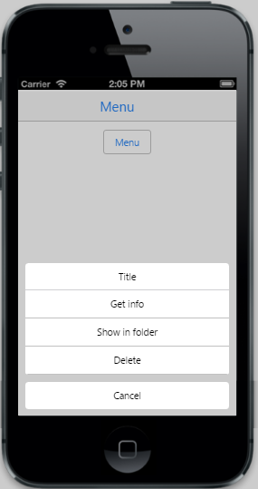

# Show Menu 

The Menu is shown by tap or taphold action on the target element and by setting the ID of target element in 'Target' property. Set the ShowOn property to specify the event after which  Menu is shown. By updating the desired event, the Menu shows when that particular event happens on the target element. Refer to the following code example. Here button is the target control (element). So its target ID (“menutarget”) is mentioned in the TargetId property. On clicking it, Menu control is displayed. 



                    

                        @Html.EJMobile().Button("menutarget").Text("Menu")

                    

                    @Html.EJMobile().Menu("menu_sample").Target("menutarget").ShowOn(ShowOn.Tap).Items(item =>
{

    item.Add().Text("Get info");

    item.Add().Text("Show in folder");

    item.Add().Text("Delete");

})			


The following screenshot displays the Show Menu:

