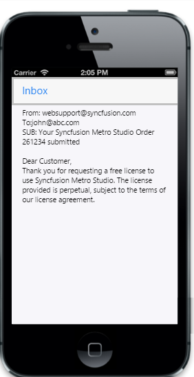

# Getting Started

## Create your first NavigationBar in JavaScript

The ASP.NET MVC mobile Toolbar provides a single interface to select a command from a collection of commands. It also provides template support. In this example, you can learn how to create a Mail App and through that you can learn the features of Mobile Toolbar Widget.

## Create the necessary layout

The ASP.NET MVC Mobile NavigationBar  Control  created by using number of <ul> and <li>. Each <li> item performs individual actions. You can customize the NavigationBar control by changing its properties according to your requirement. 

Create a simple MVC application and paste the following header in layout page content inside the <body>tag of layout.cshtml. You can create a MVC Project and add necessary Dll’s and Scripts with the help of the [MVC Getting Started Documentation](https://help.syncfusion.com/aspnetmvc/getting-started).



        @Html.EJMobile().NavigationBar("header").Title("Inbox")
    

    

        <!-- Content that needs to be scrolled-->
        

            <!--Adding Inbox sample content-->

            

                From: websupport@syncfusion.com 

                To:john@abc.com 

                SUB: Your Syncfusion Metro Studio Order 261234 submitted 

                 

                

                    Dear Customer, 

                    Thank you for requesting a free license to use Syncfusion Metro Studio. The license provided is perpetual, subject to the terms of our license agreement.

                

            

            <!—Adding dialog control -->

            

                

                

            

        

    

    



Execute this code to render the following output.

