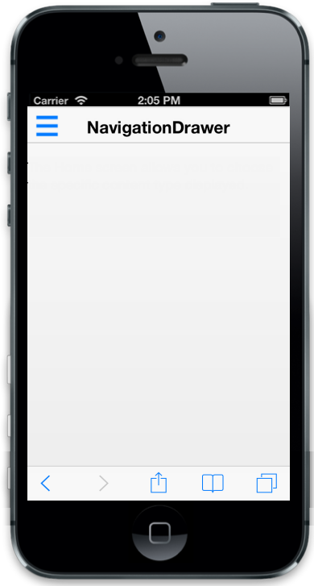
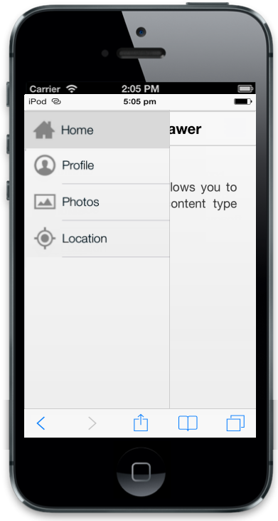

## Configure target element

The TargetId property is used to define the target Id for Navigation Drawer. The drawer opens while you click on the specified target element.

Refer to the following code example. 

&lt;div id="target" class="targeticon"&gt;&lt;/div&gt;      @Html.EJMobile().NavigationDrawer("navpane").TargetId("target").EnableListView(true).ListViewSettings(list =>

{

    list.ClientSideEvents(i => i.TouchEnd("navListClick")).Items(item =>

        {

            item.Add().Text("Home").ImageUrl("http://js.syncfusion.com/UG/Mobile/Content/drawer/home.png");

            item.Add().Text("Profile").ImageUrl("http://js.syncfusion.com/UG/Mobile/Content/drawer/profile.png");

            item.Add().Text("Photos").ImageUrl("http://js.syncfusion.com/UG/Mobile/Content/drawer/photo.png");

            item.Add().Text("Location").ImageUrl("http://js.syncfusion.com/UG/Mobile/Content/drawer/locations.png");

        });

})

@Html.EJMobile().Header("head").Title("NavigationDrawer").Position(MobileHeaderPosition.Normal)

    &lt;div id="content" style="margin-top: 45px;"&gt;

        &lt;div id="Home"&gt;

              The Home screen allows you to choose the specific content type displayed.

        &lt;/div&gt;

        &lt;div id="Profile" style="display: none"&gt;

            The Profile page content is displayed.

        &lt;/div&gt;

        &lt;div id="Photos" style="display: none"&gt;

            The Photos page content is displayed.

        &lt;/div&gt;

        &lt;div id="Location" style="display: none"&gt;

            The Location page content is displayed.

        &lt;/div&gt;

    &lt;/div&gt;

    &lt;style&gt;

        .targeticon {

            background: url("http://js.syncfusion.com/UG/Mobile/Content/drawer/sprite.png") no-repeat scroll 0 -344px rgba(0, 0, 0, 0);

            height: 48px;

            left: 10px;

            position: absolute;

            top: 5px;

            width: 48px;

            z-index: 3;

        }

    &lt;/style&gt;

Refer to the script section to update the page content while clicking the item in the drawer.

{  | markdownify }
{:.image }

You can display the drawer either by clicking on the target icon or else by swiping from left. Refer to the following screenshot.

{  | markdownify }
{:.image }

