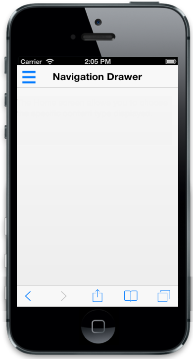
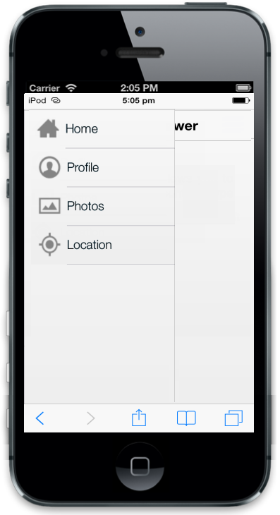

# Getting Started

## Create your first Navigation Drawer Control in MVC

The ASP.NET MVC Mobile Navigation Drawer is a sliding panel that displays the list of navigation options on demand. That is, by default, it is not visible but you can display it onto the left/right side of the screen by swiping or by clicking with desired target icon.

{{ '' | markdownify }}
{:.image }

The following steps guide you in adding a Navigation Drawer control for a mobile application that displays a list of items such as home, profile, photos and location where you can navigate to desired page by clicking on the option available in the drawer. 

Create basic mobile layout

The following steps explain you on how to add a Navigation Drawer control.

1. Creating a MVC Project and adding necessary Dll’s and Scripts using the [MVC-Getting Started Documentation](http://help.syncfusion.com/ug/js/default.htm).
2. Add the following code example in layout page of the application.

    <!-- Adding Header Control Here -->

    

           @RenderBody()

    

Add Header control for Navigation Drawer

To render the Header control, add the following code example in the corresponding view page. To set header title, you can use the ‘Title’ property with desired title.

   <!-- Adding Header Control Here -->

   Html.EJMobile().Header("header").Title("Navigation Drawer").Position(MobileHeaderPosition.Normal).ShowLeftButton(true).LeftButtonImageClass("icon-target")

Add Navigation Drawer control

To add a Navigation Drawer control, call NavigationDrawer helper. You can display a navigable option as a list by using listview. To achieve this, set the EnableListView property as true in navigation drawer wrapper element. You can set thetext for list itemsby using Text property.

    <!-- Adding Navigation Drawer Control here -->

    @Html.EJMobile().NavigationDrawer("navpane").EnableListView(true).ListViewSettings(list => list.Items(item =>

        {

            item.Add().Text("Home");

            item.Add().Text("Profile");

            item.Add().Text("Photos");

            item.Add().Text("Location");

        }))

Add target element to display drawer

You can display the drawer by clicking on target icon. To achieve this, set the target element’s id with ‘TargetId’ property of the navigation drawer wrapper element.

        <!-- Adding Navigation Drawer Control here -->

            @Html.EJMobile().NavigationDrawer("navpane").TargetId("target_leftbutton").EnableListView(true).ListViewSettings(list => list.Items(item =>

        {

            item.Add().Text("Home");

            item.Add().Text("Profile");

            item.Add().Text("Photos");

            item.Add().Text("Location");

        }))

To set the target icon image from sprite and to position the target icon properly use the following styles.

Run the above code to render the following output. To know how to run the code, refer to this [section](http://help.syncfusion.com/ug/js/default.htm)

{{ '' | markdownify }}
{:.image }

You can display the drawer either by clicking on the target icon or by swiping from left. Refer to the following screenshot.

{{ '' | markdownify }}
{:.image }

Add images for Navigation Drawer

You can set the images for Navigation Drawer by using ImageClass property in the inner list elements.

<!-- Adding Navigation Drawer Control here -->

@Html.EJMobile().NavigationDrawer("navpane").TargetId("header_leftbutton").EnableListView(true).ListViewSettings(list => list.Items(item =>

        {

            item.Add().Text("Home").ImageClass("icon-home");

            item.Add().Text("Profile").ImageClass("icon-profile");

            item.Add().Text("Photos").ImageClass("icon-photo");

            item.Add().Text("Location").ImageClass("icon-locations");

        }))

You can define the image classes specified for the list items as follows.

Run the above code to render the following output. To know how to run the code, refer to this [section](http://help.syncfusion.com/ug/js/default.htm)

{{ '' | markdownify }}
{:.image }

Load appropriate content while selection

You can load the desired content for the navigation items by updating the content through touch end handler of listview. Also to know which item’s content is being loaded in the page, you can make a list selection to persist in the drawer by setting PersistSelection as true through ListViewSettings action.

Refer to the following code example.

   <!-- Adding Navigation Drawer Control here -->

            @Html.EJMobile().NavigationDrawer("navpane").TargetId("header_leftbutton") .ContentId("content").EnableListView(true).ListViewSettings(list =>

{

    list.PersistSelection(true).Items(item =>

        {

            item.Add().Text("Home").ImageClass("icon-home") .Href("#Home");

            item.Add().Text("Profile").ImageClass("icon-profile") .Href("#Profile");

            item.Add().Text("Photos").ImageClass("icon-photo") .Href("#Photos");

            item.Add().Text("Location").ImageClass("icon-locations") .Href("#Location");

        });

})

While clicking the navigation options, it loads the appropriate content into the current page. To achieve this, set some sample content to load on selecting the items. Refer to the following code example.

<!-- Adding the Navigation Drawer page content-->

      <!-- Home Page Content-->

        <div id="content">

            <div id="Home">

                The Home screen allows you to choose the specific content type displayed.

            

            <!-- Profile Page Content-->

            <div id="Profile">

                The Profile page content is displayed.

            

            <!-- Photos Page Content-->

            <div id="Photos">

                The Photos page content is displayed.

            

            <!-- Location Page Content-->

            <div id="Location">

                The Location page content is displayed.

            

        

Add the following code example to display the first listitem content while rendering.

Run the above code to render the following output. To know how to run the code, refer to this [section](http://help.syncfusion.com/ug/js/default.htm).

{{ '' | markdownify }}
{:.image }

