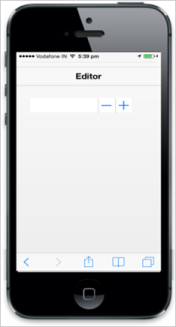

# Border Support

The ShowBorder property is used to specify whether Textbox border is visible or hidden.



@Html.EJMobile().NumericTextbox("textbox_sample").ShowBorder(false)



The following screenshot displays the output.

