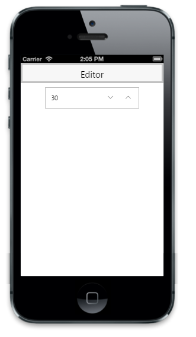

## Customize Value

The current value of the Numeric Textbox can be specified by using the Value property. The range for the Numeric Textbox can be specified by using the MaxValue and MinValue properties. The Numeric Textbox can only accept values within the specified range. The IncrementStep property is used to set the step value in each incrementing or decrementing textbox when the spin buttons are clicked or when the up or down arrows are used.



@Html.EJMobile().NumericTextbox("textbox_sample").Value("30").IncrementStep(2).MaximumValue(100).MinimumValue(3)



The following screenshot displays the output.

{{ '' | markdownify }}
{:.image }



@Html.EJMobile().NumericTextbox("textbox_sample").DecimalPlaces(3)



