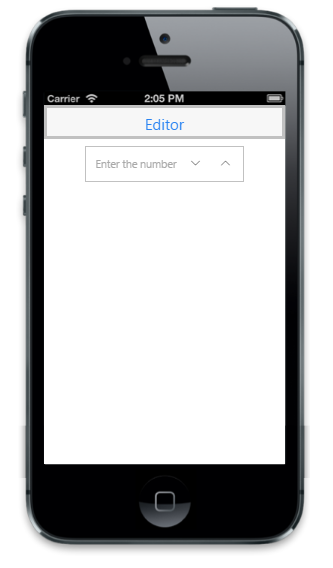

# Customize Watermark Text

The WatermarkText property is used to define watermark text in the control, that is, it acts like a label for the Textbox. This text appears in the background of the Numeric Textbox.



@Html.EJMobile().NumericTextbox("textbox_sample").WatermarkText("Enter the number")



The following screenshot displays the output.

