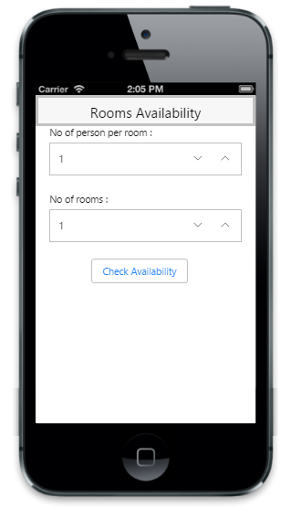

# Getting Started 

In this section you can learn how to create first Numeric Textbox Control in mobile application.

## Create your first Numeric Textbox in MVC

The following is an example for Rooms Availability Check and it describes how simple it is to create the first layout of Numeric Textbox and how efficient it is to use the features of the control.

### Create the required layout

You can render the Numeric Textbox control based on the default values for all the properties. You can easily customize Numeric Textbox control by changing their properties according to your requirements.

You can create an MVC Project and add necessary assemblies, styles and scripts to it.  Refer [MVC-Getting Started.](http://help.syncfusion.com/ug/js/Documents/gettingstartedwithmv.htm)

1. Create a View page and add the following template.


 <!--Page Header-->

    @Html.EJMobile().Header("page_header").Title("Rooms Availability").Position(MobileHeaderPosition.Fixed)

    

        

                <!--Numeric TextBox 1 code here-->

                <!--Numeric TextBox 2 code here-->

            

                @Html.EJMobile().Button("but_submit").Text("Check Availability")                        

            

        

    



2. Add the following code example to render Numeric Textbox to input number of persons per room.


<!--Numeric TextBox 1 code-->

   <label>No of person per room :</label>

  @Html.EJMobile().NumericTextbox("persontext").ShowSpinButton(true).MinimumValue(1).MaximumValue(6)



3. Add the following code example to render Numeric Textbox to input number of rooms needed.


<!--Numeric TextBox 2 code-->

   <label>No of rooms :</label>

   @Html.EJMobile().NumericTextbox("roomstxt").ShowSpinButton(true).MinimumValue(1).MaximumValue(5)



4. To improve the look and feel of Rooms Availability Check, you need to add the following styles in the application.




{  | markdownify }
{:.image }

