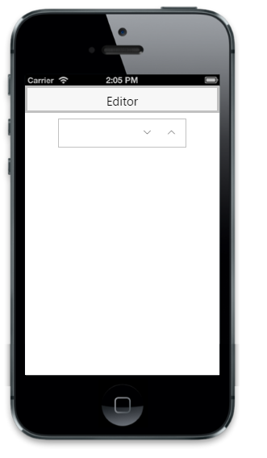

# Readonly support

The ReadOnly property is used to enable or disable value changes in the Textbox.



@Html.EJMobile().NumericTextbox("textbox_sample").ReadOnly(false)



The following screenshot displays the output.

