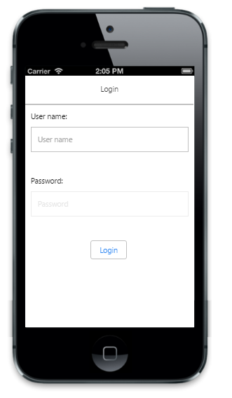

# Enable and disable

The Enabled property is used to enable or disable your Password control. The default value is “True”.

Refer to the following code example.



<!-- Password textbox -->

@Html.EJMobile().PassWord("textbox_sample").WatermarkText("password").Enabled(false)



Run this code example and you can see the following output.

