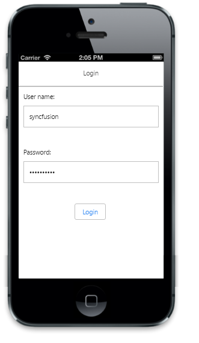

# Getting started

This section describes in brief how to create and customize an ASP.NET MVC Mobile Password widget.

## Create your first Password textbox in ASP.NET MVC

Using the following guidelines, you can create a basic login form using the Password Textbox control.

### Create Password Textbox

Create a simple MVC application and add the following NavigationBar and Scroll panel layout page content inside the <body> tag of layout.cshtml. To create an MVC Project, and add necessary Dll’s and Scripts you can refer to [MVC-Getting Started Documentation](http://help.syncfusion.com/js/) for Mobile.  



<!-- header control -->          

@Html.EJMobile().NavigationBar("header").Mode(NavBarMode.Header).Title("Login")

<form id="loginForm">

<label>

User Name

</label>

@Html.EJMobile().TextBox("userName").WatermarkText("User Name")                

<label>

Password

</label>

<!-- Add Password textbox here -->

@Html.EJMobile().Button("submit").Text("Login")

</form>

<!-- ScrollPanel -->
@Html.EJMobile().Scrollpanel("scrollPanel").Target("sample") 



Add the following code in the corresponding view page to render the Password Textbox control.



<!-- Password textbox -->

@Html.EJMobile().PassWord("password") 



Add the following styles to show the Password control in an order. 





Run this code example and you can see the following output.

## Set Watermark text

The watermark text specifies a short hint that describes the expected value of the input field. This can be achieved by using the “watermarktext” property.



<!-- Password textbox -->

@Html.EJMobile().PassWord("password").WatermarkText("Password")



Run this code example and you can see the following output.

