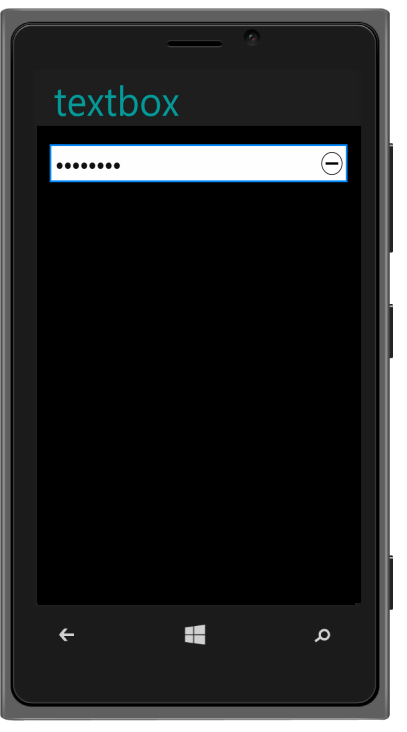

## Windows Specific Customization

The AllowReset property is used to reset the password value in Windows render mode. The default value is “True”.

Refer to the following code example.



@Html.EJMobile().PassWord("textbox_sample").WatermarkText("Password").RenderMode(RenderMode.Windows).Windows(windows=>windows.AllowReset(true))



{{ '' | markdownify }}
{:.image }

