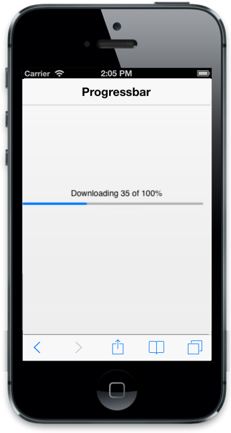

# Customize percentage

 Specifies the ProgressBar value in percentage that depends on maximum value. You can refer to the following code examples.  



@Html.EJMobile().ProgressBar("progressbar_sample").MaximumValue(200).Percentage(35)



Output of percentage:

