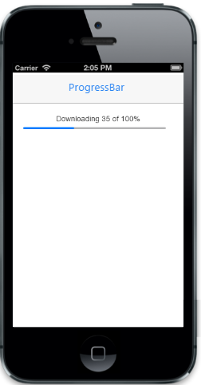

## Customize Percentage

Percentage property is used to specify the ProgressBar value in percentage that depends on maximum value. You can refer to the following code examples.  

@Html.EJMobile().ProgressBar("progressbar_sample").MaximumValue(200).Percentage(35)

Output of Percentage:

{{ '' | markdownify }}
{:.image }

