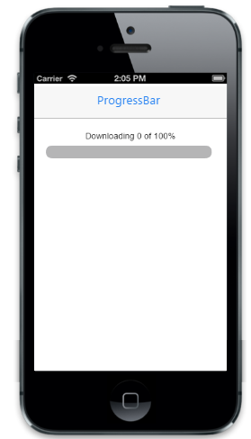

## Customize dimensions

By setting an integer value to Height property, you can change the height of the ProgressBar. The width of the ProgressBar is changed by using Width property. You can refer to the following code examples.



@Html.EJMobile().ProgressBar("progressbar_sample").Height(10)



Output of Customize dimensions:

