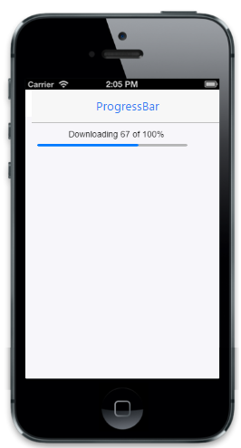

# Customize value

The current value of the ProgressBar is specified by using 'Value' property. "MaxValue" property holds the maximum value where the progress ends. MinValue property holds the minimum value where the progress starts. Set the step value to be added in each increment when progress goes on by using the IncrementStep property. You can refer to the following code examples.



@Html.EJMobile().ProgressBar("progressbar_sample").Value(55).MaximumValue(90).MinimumValue(10).IncrementStep(5)



Output of customize value:

