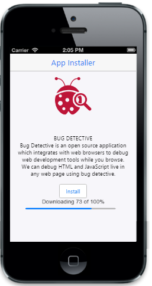
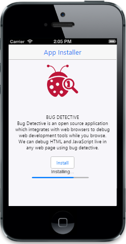
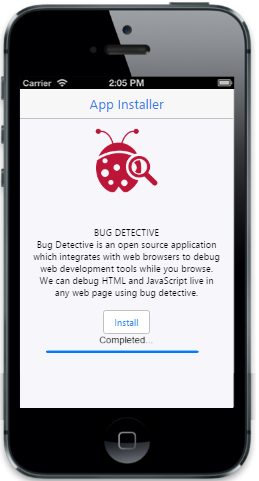

# Getting Started

In this section, you can learn how to create ProgressBar and how to use it in your application.

## Create your first ProgressBar in MVC

ASP.NET MVC, Mobile ProgressBar is a simple interface that indicates the current progress of an operation, such as uploading a document. In the following guidelines, you will learn about the features in ProgressBar widget and create an App Installer.

### Create the required layout for App Installer

The ASP.NET MVC Mobile ProgressBar widget is rendered by calling ProgressBar helper method with corresponding properties. You can easily customize ProgressBar control by changing its properties according to your requirements. In the App Installer, the ProgressBar is used to show the progress of installation. 

Create a simple MVC application and paste the following header and scrollpanel layout page content inside the body tag of layout.cshtml. Paste other templates in the view page for ProgressBar creation. 

You can create an MVC Project and add necessary Dlls and script, with the help of the [MVC-Getting Started Documentation.](https://help.syncfusion.com/aspnetmvc/getting-started )


<!-- Layout Page Content -->
<!-- header control -->
@Html.EJMobile().NavigationBar("header").Title("App Installer")

<!-- ScrollPanel -->
@Html.EJMobile().Scrollpanel("scrollpanel").Target("content")

<!-- View Page Content -->

    

        <!-- Add image and definition -->

        

            

        
   

        

            <b>BUG DETECTIVE</b> 

            Bug Detective is an open source application which integrates with web browsers to debug web development tools while you browse. We can debug HTML and JavaScript live in any web page using bug detective.

        
 

        <!-- Button control -->

        

            @Html.EJMobile().Button("button").Text("Install").ClientSideEvents(eve => eve.TouchEnd("startProgress"))

        

        <!--Add progressbar Element here-->

    



Run the above code example and you can see the following output.

### Create ProgressBar Control

You can call ProgressBar helper to render ProgressBar control. You can set its initial value by using Value property. By default, it takes parent’s width. But, you can customize it by using Width property.



 <!--ProgressBar control -->

      @Html.EJMobile().ProgressBar("progress").Value(73)



You can hide ProgressBar, with desired action on its hide API and you can show it with desired action on its show API.





Run the above code example and you can see the following output.

### Customize Text

The default text of ProgressBar is downloading. In this scenario you are installing the app, not downloading it. So, to change the text of ProgressBar, you can use the Text property. Add the following code example to the ProgressBar helper.



<!-- Progressbar control -->

  @Html.EJMobile().ProgressBar("progress").Value(73).EnableCustomText(true).Text("Installing..")

 



Run the above code example and you can see the following output.

### Customize Text and Value Dynamically

The ProgressBar text and its value can be changed dynamically. In this scenario, to indicate the progress of installation, its value dynamically changes when you click the Install button. And when it reaches 100%, then the ProgressBar text will change from Installingto Completed. Here, its value must start from zero, so that the Value property is removed and modifies the following code example.  



<!-- Progressbar control -->

@Html.EJMobile().ProgressBar("progress").EnableCustomText(true).Text("Installing..")

@* Value(73) is removed here *@



You can use setInterval function in JavaScript to change its value and text dynamically.





Run the above code example and you can see the following output, after you click the Install button. The following output is taken after the ProgressBar value reaches 100%. The text of the ProgressBar is changed in the following output.	

