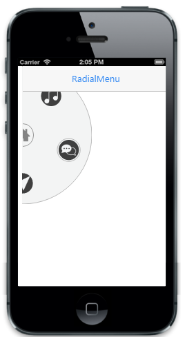
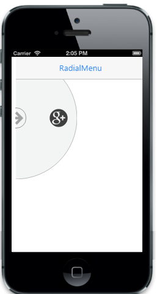

# Customize buttons

You can simply customize the Radial Menu Center and Back buttons (images) by using ImageClass and BackImagecCass properties respectively. 

The Radial Menu control is essentially a context menu presenting its items in a circular arrangement around a center button. Sub-Items are also supported in Radial Menu. To navigate to sub items, click the center button and the corresponding sub-items group is displayed. Nested Radial menu contains the second level back button. In this case you can use BackImageClass property to change the back button image. 

Refer to the following code example.




        @Html.EJMobile().RadialMenu("radialmenu_sample").ImageClass("imageclass").BackImageClass("backimage").Position(RadialMenuPosition.LeftTop).Items(item =>
{
    item.Add().ImageURL("http://js.syncfusion.com/UG/Mobile/Content/radial/ios7/light/music.png");
    item.Add().ImageURL("http://js.syncfusion.com/UG/Mobile/Content/radial/ios7/light/social.png").Children(child =>
    {

        child.Add().ImageURL("http://js.syncfusion.com/UG/Mobile/Content/radial/ios7/light/googleplus.png");

        child.Add().ImageURL("http://js.syncfusion.com/UG/Mobile/Content/radial/ios7/light/facebook.png");

    });
    item.Add().ImageURL("http://js.syncfusion.com/UG/Mobile/Content/radial/ios7/light/direction.png");
    item.Add().ImageURL("http://js.syncfusion.com/UG/Mobile/Content/radial/ios7/light/browser.png").Children(child =>
    {

        child.Add().ImageURL("http://js.syncfusion.com/UG/Mobile/Content/radial/ios7/light/chrome.png");

        child.Add().ImageURL("http://js.syncfusion.com/UG/Mobile/Content/radial/ios7/light/opera.png");

        child.Add().ImageURL("http://js.syncfusion.com/UG/Mobile/Content/radial/ios7/light/bing.png");

        child.Add().ImageURL("http://js.syncfusion.com/UG/Mobile/Content/radial/ios7/light/yahoo.png");

    });
    item.Add().ImageURL("http://js.syncfusion.com/UG/Mobile/Content/radial/ios7/light/message.png").Children(child =>
    {

        child.Add().ImageURL("http://js.syncfusion.com/UG/Mobile/Content/radial/ios7/light/google.png");

        child.Add().ImageURL("http://js.syncfusion.com/UG/Mobile/Content/radial/ios7/light/yahoo.png");

    });

})








The following screenshot illustrates the output of the above code.

