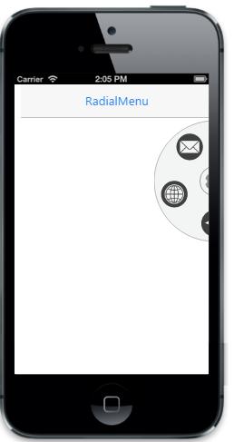

# Dimensions

You can customize Radial Menu width (radius) by using Radius property and its position by using Position property.

The Possible values for Position property are

* Leftcenter
* Lefttop
* Leftbottom
* Rightcenter   
* Righttop
* Rightbottom




        @Html.EJMobile().RadialMenu("defaultradialmenu").Position(RadialMenuPosition.RightCenter).Radius(100).ImageClass("imageclass").Items(item =>
{
    item.Add().ImageURL("http://js.syncfusion.com/UG/Mobile/Content/radial/ios7/music.png");
    item.Add().ImageURL("http://js.syncfusion.com/UG/Mobile/Content/radial/ios7/social.png");
    item.Add().ImageURL("http://js.syncfusion.com/UG/Mobile/Content/radial/ios7/light/direction.png");
    item.Add().ImageURL("http://js.syncfusion.com/UG/Mobile/Content/radial/ios7/light/browser.png");
    item.Add().ImageURL("http://js.syncfusion.com/UG/Mobile/Content/radial/ios7/light/message.png");
})








The following screenshot illustrates the output of the above code.

