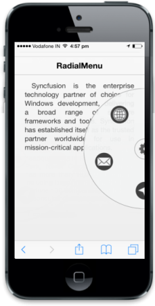

# Radial Menu

EssentialStudio ASP.NET MVC,Mobile Radial Menu control is a context that represent the menu items in a circular order with a center button element in it. By default, only the center button is visible. The Radial Menu displays the root level menu item with rotational animation effects on clicking the center menu button. You can close it either by clicking on document or by clicking on the center button when the root level items are displayed.

N> As per guidelines, the radial menu is displayed partially for an elegant look and feel but the control renders as a circular element only. Hence for Mobile (both phone and tablet mode) your Radial Menu control appears as semi-circular element, except in Windows mode where it is displayed as a circular element.

## Key Features

* Nested Menu: Support to render child menu item.

## Create your first Radial Menu control in MVC

EssentialStudio ASP.NET MVC,Mobile Radial Menu control is a context that represent the menu items in a circular order with a center button element in it. By default, only the center button is visible. The Radial Menu displays the root level menu item with rotational animation effects on clicking the center menu button. You can close it either by clicking on document or by clicking on the center button when the root level items are displayed.

The following steps guide you to add a Radial Menu control for a mobile application. 

## Create basic mobile layout

1. Refer [MVC-Getting Started Documentation](http://help.syncfusion.com/js/) to create a MVC Project, add necessary Dll’s and Scripts.
2. Add the following code in layout.cshtml page to create a header element.
   
   ~~~ html
		@Html.EJMobile().Header("Header").Title("RadialMenu")
   

   ~~~
   

3. Create the page content as follows.
   
   ~~~ html
		<div style="padding: 66px 25px; text-align: justify ">
		

		Syncfusion is the enterprise technology partner of choice for Windows development, delivering a broad range of software frameworks and tools. Syncfusion has established itself as the trusted partner worldwide for use in mission-critical applications.
		

		

   ~~~
   

## Add Radial Menu control

Refer to the following code example to add a Radial Menu in the corresponding view page. You can specify images for each menu items by setting the ‘ImageURL’ property.



@Html.EJMobile().RadialMenu("defaultradialmenu").Items(item =>

{

item.Add().ImageURL("http://js.syncfusion.com/UG/Mobile/Content/radial/google.png").Windows(ev => ev.Text("google"));

item.Add().ImageURL("http://js.syncfusion.com/UG/Mobile/Content/radial/music.png")").Windows(ev => ev.Text("music"));   item.Add().ImageURL("http://js.syncfusion.com/UG/Mobile/Content/radial/direction.png")").Windows(ev => ev.Text("direction"));    item.Add().ImageURL("http://js.syncfusion.com/UG/Mobile/Content/radial/message.png")").Windows(ev => ev.Text("message"));item.Add().ImageURL("http://js.syncfusion.com/UG/Mobile/Content/radial/browser.png")").Windows(ev => ev.Text("browser"));

})



Run the above code to render the following output. To know how to run the code, refer to this [section](http://help.syncfusion.com/js/).

